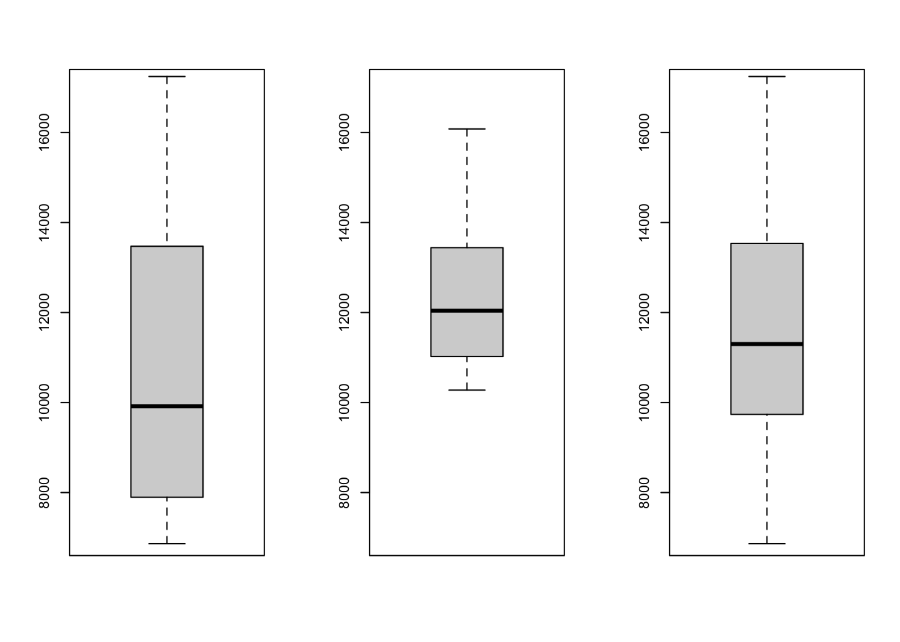
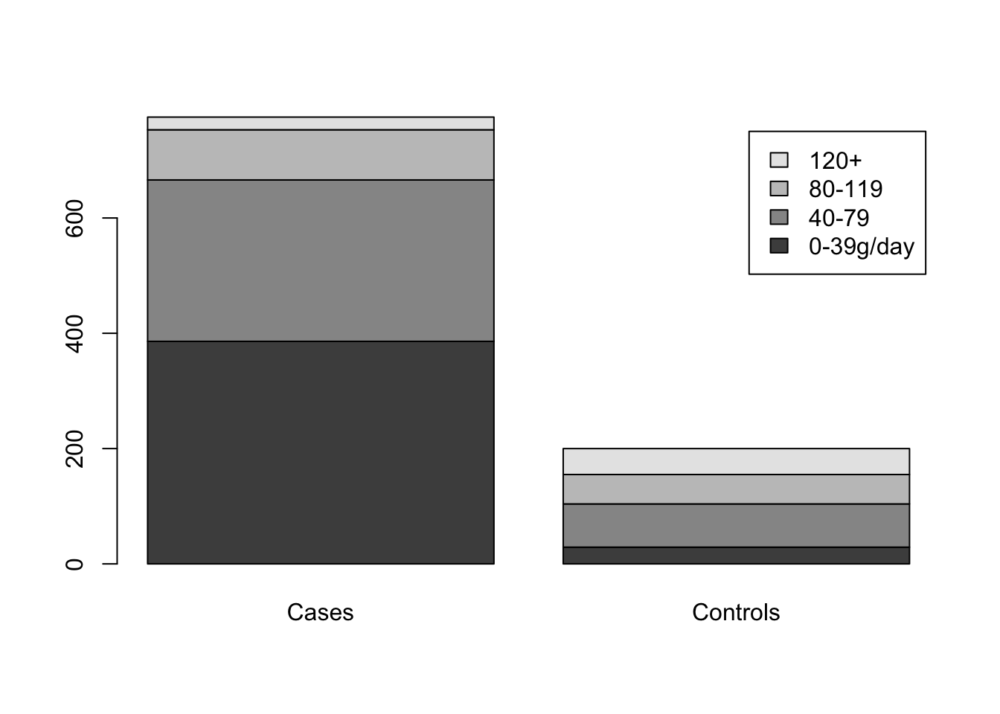
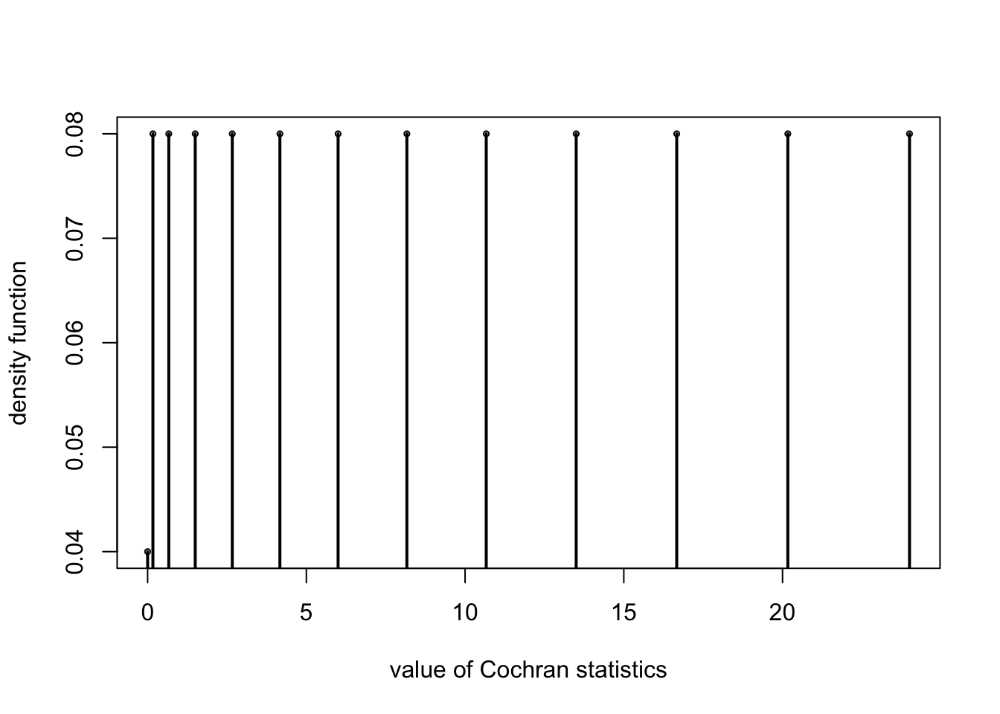

# 双样本位置参数

**第一部分 两个独立总体**

### 例子：零件疲劳强度测试


```r
x <- c(82, 64, 53, 61, 59, 83, 76, 55, 70, 73)

y <- c(80, 60, 65, 91, 86, 84, 77, 93, 75)

##wilcoxon rank sum test
wilcox.test(x,y)
```

```
## 
## 	Wilcoxon rank sum exact test
## 
## data:  x and y
## W = 19, p-value = 0.03499
## alternative hypothesis: true location shift is not equal to 0
```


## 3.1 Brown-Mood中位数检验 

  - 检验两总体中位数是否相等；
  - 计算两样本共同的中位数$M_{XY}$，用两个样本和$M_{XY}$比较后得到各个样本中大于和小于它的数目；
  - 利用超几何分布

### 精确检验


```r
z=read.table("data/salary.txt")
(salary1 <- z[,1][z[,2]==1]) #样本1
```

```
##  [1]  6864  7304  7477  7779  7895  8348  8461  9553  9919 10073 10270 11581
## [13] 13472 13600 13962 15019 17244
```

```r
(salary2 <- z[,1][z[,2]==2]) #样本2
```

```
##  [1] 10276 10533 10633 10837 11209 11393 11864 12040 12642 12675 13199 13683
## [13] 14049 14061 16079
```

```r
par(mfrow=c(1,3)) #箱线图
boxplot(salary1,ylim=c(7000,17000))
boxplot(salary2,ylim=c(7000,17000))
boxplot(z[,1],ylim=c(7000,17000))
```




```r
k=unique(z[,2]); # 样本编号
(m=median(z[,1])); # 中位数
```

```
## [1] 11301
```

```r
m1=NULL;m2=NULL
for(i in k){
  m1=c(m1,sum(z[z[,2]==i,1]>m)) # 大于中位数的个数
  m2=c(m2,sum(z[z[,2]==i,1]<m)) # 小于等于中位数的个数
}
(C=rbind(m1,m2))
```

```
##    [,1] [,2]
## m1    6   10
## m2   11    5
```

```r
##H1:Mx<My
phyper(6,17,15,16) # 利用超几何分布计算概率 # phyper(a,m,n,a+b)
```

```
## [1] 0.07780674
```

```r
fisher.test(C,alt="less") # 使用fisher.test函数
```

```
## 
## 	Fisher's Exact Test for Count Data
## 
## data:  C
## p-value = 0.07781
## alternative hypothesis: true odds ratio is less than 1
## 95 percent confidence interval:
##  0.000000 1.166386
## sample estimates:
## odds ratio 
##  0.2848586
```

### 大样本近似

$$Z=\frac{A \pm 0.5 -mt/N}{\sqrt{mnt(N-t)/N^3}} \sim N(0,1)$$

```r
pnorm((6+.5-17*16/32)/sqrt(17*15*16*(32-16)/32^3))
```

```
## [1] 0.07824383
```

$$K=\frac{(2A-m)^2(m+n)}{mn} \sim \chi^2_{(1)}$$


```r
(K=(2*6-17)^2*(17+15)/17/15)
```

```
## [1] 3.137255
```

```r
1-pchisq(K,1) # p值
```

```
## [1] 0.0765225
```


## 3.2 Wilcoxon秩和检验

  - 利用更多的关于样本点相对大小的信息 
  
### *例：Wilcoxon Test for Stochastic Ordering of Alternatives


```r
#(Esophageal Cancer). This example is based on the case control study of esophageal cancer in Ile-et-Vilaine, France (Breslow et al. 1980). These data are available in the datasets package. We test the hypothesis that alcohol consumption is the same in the two groups, using as our dataset a sample of cases and controls
library(datasets)
data(esoph)
x1<-rep(esoph$alcgp,esoph$ncases)
y1<-rep(esoph$alcgp,esoph$ncontrols)
z1<-c(x1,y1)
w1<-c(rep(1,length(x1)),rep(0,length(y1)))
barplot(table(z1,w1),names.arg=c('Cases','Controls'),legend.text=levels(esoph$alcgp))
```



```r
(x1<-as.numeric(x1))
```

```
##   [1] 4 1 2 2 2 2 4 4 4 4 1 2 2 2 2 2 2 2 2 2 2 2 2 2 2 2 2 2 2 2 2 3 3 3 3 3 3
##  [38] 3 3 3 3 3 3 4 4 4 4 4 4 4 4 4 4 4 4 4 1 1 1 1 1 1 1 1 1 1 1 1 2 2 2 2 2 2
##  [75] 2 2 2 2 2 2 2 2 2 2 2 2 2 2 2 2 3 3 3 3 3 3 3 3 3 3 3 3 3 3 3 3 3 3 3 3 3
## [112] 3 3 3 4 4 4 4 4 4 4 4 4 4 4 4 4 4 4 4 4 4 1 1 1 1 1 1 1 1 1 1 1 2 2 2 2 2
## [149] 2 2 2 2 2 2 2 2 2 2 2 2 2 2 2 2 2 2 2 2 3 3 3 3 3 3 3 3 3 3 3 3 3 4 4 4 4
## [186] 4 4 1 1 1 1 2 2 2 2 3 3 4 4 4
```

```r
(y1<-as.numeric(y1))
```

```
##   [1] 1 1 1 1 1 1 1 1 1 1 1 1 1 1 1 1 1 1 1 1 1 1 1 1 1 1 1 1 1 1 1 1 1 1 1 1 1
##  [38] 1 1 1 1 1 1 1 1 1 1 1 1 1 1 1 1 1 1 1 1 1 1 1 1 2 2 2 2 2 2 2 2 2 2 2 2 2
##  [75] 2 2 2 2 2 2 2 2 2 2 2 2 2 2 2 2 2 2 2 2 2 2 2 2 2 2 2 2 2 2 2 2 3 3 3 3 3
## [112] 4 4 4 4 1 1 1 1 1 1 1 1 1 1 1 1 1 1 1 1 1 1 1 1 1 1 1 1 1 1 1 1 1 1 1 1 1
## [149] 1 1 1 1 1 1 1 1 1 1 1 1 1 1 1 1 1 1 1 1 1 1 1 1 1 1 1 1 1 1 1 1 1 1 1 1 1
## [186] 1 1 1 1 1 1 1 1 1 1 1 1 1 1 1 1 1 1 2 2 2 2 2 2 2 2 2 2 2 2 2 2 2 2 2 2 2
## [223] 2 2 2 2 2 2 2 2 2 2 2 2 2 2 2 2 2 2 2 2 2 2 2 2 2 2 2 2 2 2 2 2 2 2 2 2 2
## [260] 2 2 2 2 2 2 2 2 2 2 2 2 2 2 2 2 2 2 2 2 3 3 3 3 3 3 3 3 3 3 3 3 3 3 3 3 3
## [297] 3 3 3 4 4 4 4 4 4 1 1 1 1 1 1 1 1 1 1 1 1 1 1 1 1 1 1 1 1 1 1 1 1 1 1 1 1
## [334] 1 1 1 1 1 1 1 1 1 1 1 1 1 1 1 1 1 1 1 1 1 1 1 1 1 1 1 1 1 1 1 1 1 1 1 1 1
## [371] 1 1 1 1 1 1 1 1 1 1 1 1 2 2 2 2 2 2 2 2 2 2 2 2 2 2 2 2 2 2 2 2 2 2 2 2 2
## [408] 2 2 2 2 2 2 2 2 2 2 2 2 2 2 2 2 2 2 2 2 2 2 2 2 2 2 2 2 2 2 2 2 2 2 2 2 3
## [445] 3 3 3 3 3 3 3 3 3 3 3 3 3 3 3 3 3 3 3 3 3 3 3 3 3 3 4 4 1 1 1 1 1 1 1 1 1
## [482] 1 1 1 1 1 1 1 1 1 1 1 1 1 1 1 1 1 1 1 1 1 1 1 1 1 1 1 1 1 1 1 1 1 1 1 1 1
## [519] 1 1 1 1 1 1 1 1 1 1 1 1 1 1 1 1 1 1 1 1 1 1 1 1 1 1 1 1 1 1 1 2 2 2 2 2 2
## [556] 2 2 2 2 2 2 2 2 2 2 2 2 2 2 2 2 2 2 2 2 2 2 2 2 2 2 2 2 2 2 2 2 2 2 2 2 2
## [593] 2 2 2 2 2 2 2 2 2 2 2 2 2 2 2 2 2 2 2 3 3 3 3 3 3 3 3 3 3 3 3 3 3 3 3 3 3
## [630] 3 4 4 4 4 4 4 4 4 1 1 1 1 1 1 1 1 1 1 1 1 1 1 1 1 1 1 1 1 1 1 1 1 1 1 1 1
## [667] 1 1 1 1 1 1 1 1 1 1 1 1 1 1 1 1 1 1 1 1 1 1 1 1 1 1 1 1 1 1 1 1 2 2 2 2 2
## [704] 2 2 2 2 2 2 2 2 2 2 2 2 2 2 2 2 2 2 2 2 2 2 2 3 3 3 3 3 3 3 3 3 3 3 3 3 3
## [741] 3 3 4 4 1 1 1 1 1 1 1 1 1 1 1 1 1 1 1 1 1 1 1 1 1 1 1 2 2 2 2 2 2 2 2
```

```r
wilcox.test(x1,y1)
```

```
## 
## 	Wilcoxon rank sum test with continuity correction
## 
## data:  x1 and y1
## W = 115612, p-value < 2.2e-16
## alternative hypothesis: true location shift is not equal to 0
```

### *例： Analyses for a Shift in Location


```r
#(Generated t5-Data). The following are two samples generated from a t-distribution with 5 degrees of freedom. The true shift parameter was set at the value 8.
x1<-round(rt(11,5)*10+42,1)
y1<-round(rt(9,5)*10+50,1)
sort(x1)
```

```
##  [1] 16.0 25.2 27.9 28.0 30.4 37.0 43.7 44.6 44.6 45.4 60.8
```

```r
sort(y1)
```

```
## [1] 17.1 42.8 43.3 46.0 46.9 50.6 55.1 68.2 70.3
```

```r
wilcox.test(x1,y1,exact=TRUE)
```

```
## Warning in wilcox.test.default(x1, y1, exact = TRUE): cannot compute exact p-
## value with ties
```

```
## 
## 	Wilcoxon rank sum test with continuity correction
## 
## data:  x1 and y1
## W = 24, p-value = 0.05743
## alternative hypothesis: true location shift is not equal to 0
```

```r
wilcox.test(x1,y1,exact=FALSE,correct=FALSE)
```

```
## 
## 	Wilcoxon rank sum test
## 
## data:  x1 and y1
## W = 24, p-value = 0.05262
## alternative hypothesis: true location shift is not equal to 0
```

```r
wilcox.test(y1,x1,conf.int=TRUE)
```

```
## Warning in wilcox.test.default(y1, x1, conf.int = TRUE): cannot compute exact p-
## value with ties
```

```
## Warning in wilcox.test.default(y1, x1, conf.int = TRUE): cannot compute exact
## confidence intervals with ties
```

```
## 
## 	Wilcoxon rank sum test with continuity correction
## 
## data:  y1 and x1
## W = 75, p-value = 0.05743
## alternative hypothesis: true location shift is not equal to 0
## 95 percent confidence interval:
##  -0.400037 25.699973
## sample estimates:
## difference in location 
##               13.60003
```

### 3.2.1 假设检验


```r
wilcox.test(salary1,salary2,alt="less")
```

```
## 
## 	Wilcoxon rank sum exact test
## 
## data:  salary1 and salary2
## W = 69, p-value = 0.01352
## alternative hypothesis: true location shift is less than 0
```

```r
pwilcox(69,15,17)
```

```
## [1] 0.01352166
```

```r
wilcox.test(salary1,salary2)
```

```
## 
## 	Wilcoxon rank sum exact test
## 
## data:  salary1 and salary2
## W = 69, p-value = 0.02704
## alternative hypothesis: true location shift is not equal to 0
```

```r
wilcox.test(salary1,salary2,exact=F)
```

```
## 
## 	Wilcoxon rank sum test with continuity correction
## 
## data:  salary1 and salary2
## W = 69, p-value = 0.02851
## alternative hypothesis: true location shift is not equal to 0
```

```r
wilcox.test(salary1,salary2,exact=F,cor=F)
```

```
## 
## 	Wilcoxon rank sum test
## 
## data:  salary1 and salary2
## W = 69, p-value = 0.02717
## alternative hypothesis: true location shift is not equal to 0
```

```r
wilcox.test(salary1,salary2,exact=F,alt="less")
```

```
## 
## 	Wilcoxon rank sum test with continuity correction
## 
## data:  salary1 and salary2
## W = 69, p-value = 0.01425
## alternative hypothesis: true location shift is less than 0
```

```r
wilcox.test(salary1,salary2,exact=F,alt="less",cor=F)
```

```
## 
## 	Wilcoxon rank sum test
## 
## data:  salary1 and salary2
## W = 69, p-value = 0.01358
## alternative hypothesis: true location shift is less than 0
```

### 3.2.2 置信区间


```r
(D=sort(as.vector(outer(salary1,salary2,"-"))))
```

```
##   [1] -9215 -8775 -8602 -8300 -8184 -7731 -7618 -7197 -7185 -6819 -6757 -6745
##  [13] -6584 -6572 -6526 -6379 -6335 -6282 -6270 -6206 -6166 -6160 -6154 -6006
##  [25] -5904 -5895 -5811 -5809 -5788 -5778 -5722 -5713 -5701 -5600 -5588 -5420
##  [37] -5371 -5338 -5335 -5304 -5222 -5198 -5176 -5165 -5000 -4896 -4863 -4851
##  [49] -4780 -4747 -4738 -4736 -4563 -4560 -4529 -4508 -4498 -4496 -4387 -4345
##  [61] -4327 -4294 -4261 -4214 -4181 -4145 -4142 -4130 -4130 -4089 -4085 -3988
##  [73] -3976 -3973 -3969 -3916 -3905 -3791 -3779 -3769 -3764 -3732 -3692 -3669
##  [85] -3646 -3614 -3610 -3579 -3533 -3516 -3498 -3430 -3413 -3412 -3403 -3360
##  [97] -3329 -3314 -3280 -3229 -3156 -3126 -3122 -3089 -3058 -3056 -3045 -2972
## [109] -2942 -2932 -2929 -2861 -2854 -2799 -2756 -2754 -2748 -2738 -2723 -2638
## [121] -2607 -2602 -2569 -2497 -2489 -2487 -2480 -2479 -2468 -2405 -2381 -2376
## [133] -2372 -2311 -2285 -2185 -2172 -2121 -2117 -2102 -2072 -1967 -1945 -1928
## [145] -1840 -1815 -1791 -1770 -1656 -1618 -1594 -1474 -1320 -1290 -1284 -1136
## [157] -1123 -1094 -1080 -1061 -1060  -980  -939  -918  -764  -723  -714  -614
## [169]  -589  -577  -567  -560  -461  -460  -459  -449  -363  -357  -283  -263
## [181]  -211  -203   -99   -87   -83    -6   188   273   279   372   401   744
## [193]   763   797   830   925   948   958   958   970  1048  1165  1287  1305
## [205]  1320  1336  1432  1560  1608  1736  1820  1922  2079  2098  2207  2263
## [217]  2344  2377  2391  2569  2635  2753  2763  2839  2939  2967  2979  3067
## [229]  3125  3155  3183  3195  3196  3324  3329  3429  3561  3626  3686  3810
## [241]  4045  4182  4386  4486  4569  4602  4743  5204  5380  5851  6035  6407
## [253]  6611  6711  6968
```

```r
(Wa=qwilcox(0.025,17,15))
```

```
## [1] 76
```

```r
c(D[Wa],D[17*15+1-Wa])
```

```
## [1] -3916  -263
```

## 3.3 正态记分（normal score）检验

  - 用正态记分代替秩


### 例子：salary

```r
w=cbind(c(salary1,salary2),c(rep(1,17),rep(2,15)));w=w[order(w[,1]),]
w=cbind(w,1:32,qnorm((1:32)/(17+15+1)))
m=17;n=15;
Tstat = sum(w[w[,2]==1,4])
w2 = sum(w[,4]^2)
S = sqrt(m*n*w2/(m+n-1)/(m+n))
Z = Tstat/S
pnorm(Z)
```

```
## [1] 0.01925286
```


**第二部分 不独立的两个总体**


## 3.4 成对数据的检验

  - 成对数据的差，使用符号检验、Wilcoxon符号秩检验

### 例子：实施管理前后


```r
x2 <- c(1.2,-0.6,-0.3,1.1,-0.2,-0.2,-0.8,0.3,-0.2,-0.1)
library(BSDA)
```

```
## Loading required package: lattice
```

```
## 
## Attaching package: 'BSDA'
```

```
## The following object is masked from 'package:datasets':
## 
##     Orange
```

```r
SIGN.test(x2,md=0,altervative="two.sided",conf.level=0.95)
```

```
## 
## 	One-sample Sign-Test
## 
## data:  x2
## s = 3, p-value = 0.3438
## alternative hypothesis: true median is not equal to 0
## 95 percent confidence interval:
##  -0.5026667  0.8404444
## sample estimates:
## median of x 
##        -0.2 
## 
## Achieved and Interpolated Confidence Intervals: 
## 
##                   Conf.Level  L.E.pt U.E.pt
## Lower Achieved CI     0.8906 -0.3000 0.3000
## Interpolated CI       0.9500 -0.5027 0.8404
## Upper Achieved CI     0.9785 -0.6000 1.1000
```

```r
wilcox.test(x2,md=0,altervative="two.sided",conf.level=0.95)
```

```
## Warning in wilcox.test.default(x2, md = 0, altervative = "two.sided", conf.level
## = 0.95): cannot compute exact p-value with ties
```

```
## 
## 	Wilcoxon signed rank test with continuity correction
## 
## data:  x2
## V = 24.5, p-value = 0.7982
## alternative hypothesis: true location is not equal to 0
```

### 例子：病人血压


```r
bp <- read.table("data/bp.txt")
x <- bp$V1
y <- bp$V2
wilcox.test(x,y,paired = T,alt="greater")
```

```
## 
## 	Wilcoxon signed rank exact test
## 
## data:  x and y
## V = 49, p-value = 0.01367
## alternative hypothesis: true location shift is greater than 0
```

```r
psignrank(sum(rank(x-y)[x<y]),length(x))
```

```
## [1] 0.01367188
```


## 3.5 McNemar检验

  - 配对的二元取值数据
  - 二维列联表，卡方检验统计量
  - 是Cochran's Q检验的特例


### 精确检验


```r
Cochran=function(x){
  Xpchs=function(n=7,k=5){
  #output(n_1,..,n_k)-all possible combination with n_1+...+n_k=n
    temp=cbind(n:0,0:n);
    if (k>=3){
      for (j in 3:k){
        a1=temp[,1:(j-2)];a2=temp[,j-1];temp0=NULL;
        for (i in 1:length(a2)){
          if (j==3) temp0=rbind(temp0,cbind(rep(a1[i],a2[i]+1),a2[i]:0,0:a2[i]))
          if (j>3)  temp0=rbind(temp0,cbind(matrix(rep(a1[i,],a2[i]+1),
          ncol=j-2,byrow=T),a2[i]:0,0:a2[i]))
        }
        temp=temp0
      }
    }
  temp
  }
  Xpchs2=function(n=4,k=2){
  #output: all 0 and 1 columns, with n-k 0s and k- 1s columns
    Xchoose=function(n=4,k=2){
      if (k==0) aa=NULL
      if (k>=1){
        aa=matrix(1:n,ncol=1);m=0;
        if(k>1){
          for(i in 2:k){
            m=m+1;m1=nrow(aa);
            aa=cbind(matrix(rep(aa,each=n),ncol=m),rep(1:n,m1))
            aa=aa[(aa[,m+1]>aa[,m]),]
          }
        }
      };
      aa
    };
    e01=Xchoose(n,k)
    temp=matrix(0,nrow=nrow(e01),ncol=n);
    for (j in 1:nrow(temp)){
      if (k==1) temp[j,e01[j]]=1
      if (k>1) temp[j,e01[j,]]=1
      };
      temp
  }
  n=nrow(x);k=ncol(x);
  L=apply(x,1,sum);R=apply(x,2,sum);N=sum(R);
  Q0=(k*(k-1)*sum((R-mean(R))^2))/(k*N-sum(L^2));
  Ni=NULL;
  for (i in 1:k-1) Ni=c(Ni,sum(L==i));
  Ni=Ni[-1];
  eye0=Xpchs2(k,1);temp0=Xpchs(Ni[1],nrow(eye0));Ri0=temp0%*%eye0;
  prob0=factorial(Ni[1])/apply(factorial(temp0),1,prod)*(1/nrow(eye0))^(Ni[1]);
  if (length(Ni)>1){
    for (i in 2:length(Ni)){
      eye1=Xpchs2(k,i);
      temp1=Xpchs(Ni[i],nrow(eye1));
      Ri1=temp1%*%eye1;
      prob1=factorial(Ni[i])/apply(factorial(temp1),1,prod)*(1/nrow(eye1))^(Ni[i])
      Ri0=matrix(rep(t(Ri0),nrow(Ri1)),byrow=T,ncol=k)+
          matrix(rep(Ri1,each=nrow(Ri0)),ncol=k)
      prob0=rep(prob0,length(prob1))*rep(prob1,each=length(prob0))
    }
  }
  xa=k*(k-1)*apply((Ri0-apply(Ri0,1,mean))^2,1,sum)/(k*N-sum(L^2))
  nn=length(xa);xa0=sort(unique(xa));xacnt=NULL;
  for (i in 1:length(xa0)) xacnt=c(xacnt,length(xa[xa==xa0[i]]));
  plot(xa0,xacnt/nn,cex=0.5,ylab="density function",xlab="value of Cochran statistics");
  for (i in 1:length(xa0)){
    points(c(xa0[i],xa0[i]),c(xacnt[i]/nn,0),type="l",lwd=2)
  }
  list(unique(xa),cbind(rbind(t(x),L),c(R,N)),Q=Q0,
  Exactp=sum(prob0[(xa>=Q0)]),pvalue=pchisq(Q0,k-1,low=F))
}
treat=read.table("data/athletefootp.txt");
Cochran(treat[,-1])
```



```
## [[1]]
##  [1] 24.0000000 20.1666667 16.6666667 13.5000000 10.6666667  8.1666667
##  [7]  6.0000000  4.1666667  2.6666667  1.5000000  0.6666667  0.1666667
## [13]  0.0000000
## 
## [[2]]
##    [,1] [,2] [,3] [,4] [,5] [,6] [,7] [,8] [,9] [,10] [,11] [,12] [,13] [,14]
## V2    1    1    1    1    1    1    1    1    1     1     0     0     0     0
## V3    1    1    1    1    1    1    0    0    0     0     1     1     1     1
## L     2    2    2    2    2    2    1    1    1     1     1     1     1     1
##    [,15] [,16] [,17] [,18] [,19] [,20] [,21] [,22] [,23] [,24] [,25] [,26]
## V2     0     0     0     0     0     0     0     0     0     0     0     0
## V3     1     1     1     1     1     1     1     1     1     1     1     1
## L      1     1     1     1     1     1     1     1     1     1     1     1
##    [,27] [,28] [,29] [,30] [,31] [,32] [,33] [,34] [,35] [,36] [,37] [,38]
## V2     0     0     0     0     0     0     0     0     0     0     0     0
## V3     1     1     1     1     0     0     0     0     0     0     0     0
## L      1     1     1     1     0     0     0     0     0     0     0     0
##    [,39] [,40] [,41]
## V2     0     0    10
## V3     0     0    26
## L      0     0    36
## 
## $Q
## [1] 10.66667
## 
## $Exactp
## [1] 0.00154388
## 
## $pvalue
## [1] 0.001090835
```

### 大样本近似


```r
x=read.table("data/athletefootp.txt");
x=x[,-1];
n12=sum(x[((x[,1]==0)&(x[,2]==1)),])
n21=sum(x[((x[,1]==1)&(x[,2]==0)),])
McNemar=(n12-n21)^2/(n12+n21);
pvalue=1-pchisq(McNemar,df=1)
list(McNemar=McNemar,pvaluetwosided=pvalue)
```

```
## $McNemar
## [1] 10.66667
## 
## $pvaluetwosided
## [1] 0.001090835
```

## 3.6 Cohen's Kappa系数

  - 度量两位评估者之间评估一致性的指标


```r
x=read.table("data/music.txt");
w=matrix(x[,3],byrow=T,ncol=2);
I=nrow(w);n=sum(w);w=w/n;
pa=sum(diag(w));
pe=sum(apply(w,1,sum)*apply(w,2,sum))
(kap=(pa-pe)/(1-pe))
```

```
## [1] 0.5098039
```

```r
A=sum(diag(w)*(1-(apply(w,1,sum)+apply(w,2,sum))*(1-kap))^2)
tempB=matrix(rep(apply(w,1,sum),I)+rep(apply(w,2,sum),each=I),byrow=T,ncol=I)
diag(tempB)=0;
B=(1-kap)^2*sum(w*tempB^2)
CC=(kap-pe*(1-kap))^2;
ASE=sqrt((A+B-CC)/(1-pe)^2/n)
list(kappa=kap,ASE=ASE,CI=c(kap-1.96*ASE,kap+1.96*ASE))
```

```
## $kappa
## [1] 0.5098039
## 
## $ASE
## [1] 0.08133101
## 
## $CI
## [1] 0.3503951 0.6692127
```

