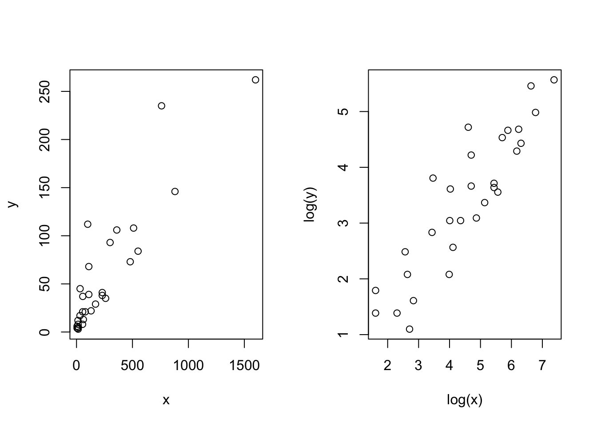
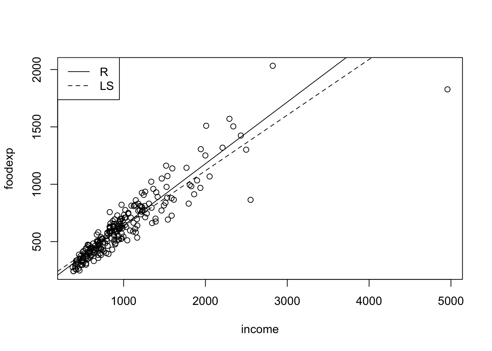
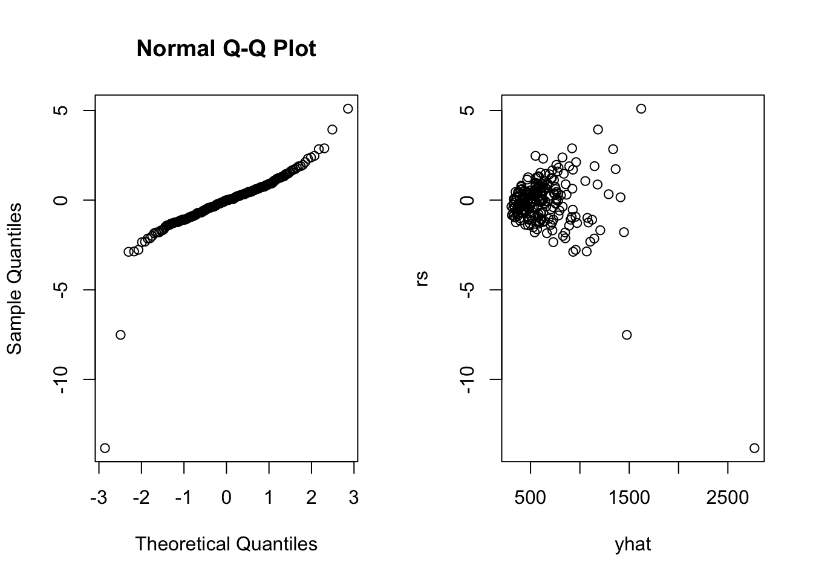

# 相关

## 6.1 Spearman秩相关检验


```r
d=read.table("data/DM1.txt");
x=d[,2];y=d[,1];
par(mfrow=c(1,2))
plot(x,y)
plot(log(x),log(y))
```



```r
rx=rank(x);ry=rank(y);
(rsd=rbind(rx,ry,(rx-ry)^2))
```

```
##    [,1] [,2] [,3] [,4] [,5] [,6] [,7] [,8]  [,9] [,10] [,11] [,12] [,13] [,14]
## rx    4    7   15    8   24   29   13  1.5 16.50     9 10.00 14.00 16.50    30
## ry    8    4   27   10   25   28    9  2.5 21.00    20  6.50 11.50 18.00    30
##      16    9  144    4    1    1   16  1.0 20.25   121 12.25  6.25  2.25     0
##    [,15] [,16] [,17] [,18] [,19] [,20] [,21] [,22] [,23] [,24] [,25] [,26]
## rx 20.50    23 11.00    26  1.50    27    18    25    22    19     6  5.00
## ry 17.00    24 11.50    26  5.00    23    13    22    15    14     1  6.50
##    12.25     1  0.25     0 12.25    16    25     9    49    25    25  2.25
##    [,27] [,28] [,29] [,30]
## rx    12 20.50    28  3.00
## ry    16 19.00    29  2.50
##       16  2.25     1  0.25
```

```r
n=length(x)
(Rs= 1-6*sum((rx-ry)^2)/(n*(n^2-1)))
```

```
## [1] 0.8775306
```

```r
cor.test(x,y,meth="pearson")
```

```
## 
## 	Pearson's product-moment correlation
## 
## data:  x and y
## t = 10.956, df = 28, p-value = 1.235e-11
## alternative hypothesis: true correlation is not equal to 0
## 95 percent confidence interval:
##  0.7996123 0.9519271
## sample estimates:
##       cor 
## 0.9004762
```

```r
cor.test(x,y,meth="spearman")
```

```
## Warning in cor.test.default(x, y, meth = "spearman"): Cannot compute exact p-
## value with ties
```

```
## 
## 	Spearman's rank correlation rho
## 
## data:  x and y
## S = 550.87, p-value = 1.965e-10
## alternative hypothesis: true rho is not equal to 0
## sample estimates:
##       rho 
## 0.8774488
```

**没有打结而且样本量不太大时，精确检验**


```r
x=c(4.2,4.3,4.4,4.5,4.7,4.6,5.3);y=c(2.6,2.8,3.1,3.8,3.6,4.0,5.0);
cor.test(x,y,exact=T,method="spearman")
```

```
## 
## 	Spearman's rank correlation rho
## 
## data:  x and y
## S = 6, p-value = 0.0123
## alternative hypothesis: true rho is not equal to 0
## sample estimates:
##       rho 
## 0.8928571
```

## 6.2 Kendall $\tau$ 相关检验


```r
d=read.table("data/CPIESI.txt");
n=nrow(d);
x=d[,2];y=d[,1]
nc=0;nd=0;n0=0;
for(i in 1:(n-1)){
  for(j in (i+1):n){
    nc=nc+((x[j]-x[i])*(y[j]-y[i])>0);
    nd=nd+((x[j]-x[i])*(y[j]-y[i])<0);
    n0=n0+((x[j]-x[i])*(y[j]-y[i])==0)
  }
}
K=nc-nd;
(tau=K/choose(n,2))
```

```
## [1] 0.4219269
```

```r
cor.test(x,y,meth="kendall")
```

```
## 
## 	Kendall's rank correlation tau
## 
## data:  x and y
## T = 642, p-value = 4.199e-05
## alternative hypothesis: true tau is not equal to 0
## sample estimates:
##       tau 
## 0.4219269
```


  - 有打结情况，调整后统计量$\tau_b$
  - Kendall's $\tau_b$还经常用于列联表数据，度量两个有序变量的相关性
  - 当列联表中行列数目差别较大时，使用Kendall's $\tau_c$


```r
xx=read.table("data/incsat.txt");
x=xx[,1];
y=xx[,2];
w=xx[,3];
n1=max(x);n2=max(y);n=sum(w);q=min(n1,n2);
WW=matrix(w,byrow=T,nrow=n1);
Dc=n^2-sum((apply(WW,2,sum))^2);
Dr=n^2-sum((apply(WW,1,sum))^2);
Vij=DD=CC=matrix(0,nrow=n1,ncol=n2)
for(i in 1:n1){
  for (j in 1:n2){
    CC[i,j]=sum((x>i)*(y>j)*w)+sum((x<i)*(y<j)*w)
    DD[i,j]=sum((x>i)*(y<j)*w)+sum((x<i)*(y>j)*w)
    Vij[i,j]=Dr*sum(WW[i,])+Dc*sum(WW[,j])
  }
}
nc=sum(WW*CC)/2;
nd=sum(WW*DD)/2;
taub=2*(nc-nd)/sqrt(Dc*Dr)
temp=sum(WW*(2*sqrt(Dc*Dr)*(CC-DD)+taub*Vij)^2)-n^3*taub^2*(Dr+Dc)^2
sigtaub=1/(Dc*Dr)*sqrt(temp);
tauc=q*(nc-nd)/(n^2)
sigtauc=2*q/((q-1)*n^2)*sqrt(sum(WW*(CC-DD)^2)-(nc-nd)^2*4/n);
list(taub=c(taub=taub,sigtaub=sigtaub,CI95=c(taub-1.96*sigtaub,taub+1.96*sigtaub)),tauc=c(tauc=tauc,sigtauc=sigtauc,CI95=c(tauc-1.96*sigtauc,tauc+1.96*sigtauc)))
```

```
## $taub
##         taub      sigtaub        CI951        CI952 
##  0.179184127  0.095542482 -0.008079138  0.366447391 
## 
## $tauc
##         tauc      sigtauc        CI951        CI952 
##  0.171475530  0.092263333 -0.009360603  0.352311662
```

## 6.3 Goodman-Kruskal's $\gamma$ 相关检验

  - 两个有序变量
  - 有大量的打结


```r
xx=read.table("data/incsat.txt")
x=xx[,1];y=xx[,2];w=xx[,3];
n1=max(x);n2=max(y);
WW=matrix(w,byrow=T,nrow=n1);
DD=CC=matrix(0,nrow=n1,ncol=n2);
for (i in 1:n1){
  for (j in 1:n2){
    CC[i,j]=sum((x>i)*(y>j)*w)+sum((x<i)*(y<j)*w)
    DD[i,j]=sum((x>i)*(y<j)*w)+sum((x<i)*(y>j)*w)
  }
}
nc=sum(WW*CC)/2;
nd=sum(WW*DD)/2;
G=(nc-nd)/(nc+nd)
ASE=1/(nc+nd)^2*sqrt(sum(WW*(2*nd*CC-2*nc*DD)^2))
pvalue=2*(1-pnorm(G/ASE));
CI95=c(G-1.96*ASE,G+1.96*ASE)
list(G=G,ASE=ASE,CI95=CI95,pvalue=pvalue)
```

```
## $G
## [1] 0.279714
## 
## $ASE
## [1] 0.145529
## 
## $CI95
## [1] -0.005522756  0.564950817
## 
## $pvalue
## [1] 0.05459941
```

## 6.4 Somers'd 相关检验


```r
xxx=read.table("data/incsat.txt")
x=xx[,1];y=xx[,2];w=xx[,3];
n1=max(x);n2=max(y);n=sum(w);
WW=matrix(w,byrow=T,nrow=n1)
Dc=n^2-sum((apply(WW,2,sum))^2);
Dr=n^2-sum((apply(WW,1,sum))^2);
Vij=DD=CC=nRi=nCj=matrix(0,nrow=n1,ncol=n2)
for (i in 1:n1){
  for (j in 1:n2){
    CC[i,j]=sum((x>i)*(y>j)*w)+sum((x<i)*(y<j)*w)
    DD[i,j]=sum((x>i)*(y<j)*w)+sum((x<i)*(y>j)*w)
    Vij[i,j]=Dr*sum(WW[i,])+Dc*sum(WW[,j])
    nRi[i,j]=n-sum(WW[i,]);
    nCj[i,j]=n-sum(WW[,j])
  }
}
nc=sum(WW*CC)/2;nd=sum(WW*DD)/2;
taub=2*(nc-nd)/sqrt(Dc*Dr)
temp=sum(WW*(2*sqrt(Dc*Dr)*(CC-DD)+taub*Vij)^2)-n^3*taub^2*(Dr+Dc)^2;
sigtaub=1/(Dc*Dr)*sqrt(temp);
dCR=2*(nc-nd)/Dr;
dRC=2*(nc-nd)/Dc;
d=4*(nc-nd)/(Dc+Dr);
sigdCR=2/Dr^2*sqrt(sum(WW*(Dr*(CC-DD)-2*(nc-nd)*nRi)^2))
sigdRC=2/Dc^2*sqrt(sum(WW*(Dc*(CC-DD)-2*(nc-nd)*nCj)^2))
sigd=sqrt(2*sigtaub^2/(Dc+Dr)*sqrt(Dc*Dr));
z=1.96;
list(dCR=c(dCR=dCR,sigdCR=sigdCR,CI95=c(dCR-z*sigdCR,dCR+z*sigdCR)),
dRC=c(dRC=dRC,sigdRC=sigdRC,CI95=c(dRC-z*sigdRC,dRC+z*sigdRC)),
d=c(d=d,sigd=sigd,CI95=c(d-z*sigd,d+z*sigd)))
```

```
## $dCR
##          dCR       sigdCR        CI951        CI952 
##  0.176536943  0.094526643 -0.008735276  0.361809162 
## 
## $dRC
##          dRC       sigdRC        CI951        CI952 
##  0.181871005  0.096832841 -0.007921364  0.371663374 
## 
## $d
##            d         sigd        CI951        CI952 
##  0.179164282  0.095537191 -0.008088613  0.366417176
```

## 6.5 Theil非参数回归

  - 类似于最小二乘法


```r
d=read.table("data/CPIGINI.txt",header=T);
x=d[,1];y=d[,2];
n=nrow(d)
s=NULL;
for(i in 1:(n-1)){
  for(j in (i+1):n){
    s=c(s,(y[j]-y[i])/(x[j]-x[i]))
  }
}
b=median(s);
a=median(y-b*x);
e=y-a-b*x;
(coef=c(a,b))
```

```
## [1] 43.650000 -1.666667
```

```r
summary(lm(y~x))
```

```
## 
## Call:
## lm(formula = y ~ x)
## 
## Residuals:
##     Min      1Q  Median      3Q     Max 
## -13.371  -5.493  -2.510   3.191  33.420 
## 
## Coefficients:
##             Estimate Std. Error t value Pr(>|t|)    
## (Intercept)  45.0656     3.2988  13.661 3.06e-16 ***
## x            -1.4888     0.5742  -2.593   0.0134 *  
## ---
## Signif. codes:  0 '***' 0.001 '**' 0.01 '*' 0.05 '.' 0.1 ' ' 1
## 
## Residual standard error: 9.005 on 38 degrees of freedom
## Multiple R-squared:  0.1503,	Adjusted R-squared:  0.128 
## F-statistic: 6.723 on 1 and 38 DF,  p-value: 0.01344
```


```r
example.ci=function(){
d=read.table("data/CPIGINI.txt",header=T);
x=d[,1];y=d[,2];
TT=function(x,y,alpha){
  n=length(x);s=NULL
  for(i in 1:(n-1)){
    for(j in (i+1):n){
      s=c(s,(y[j]-y[i])/(x[j]-x[i]));
    }
  }
b=median(s);
a=median(y-b*x); 
e=y-a-b*x; 
m=length(s);
s=sort(s);
z=NULL;
for(i in 1:m){z=c(z,cor.test(x,y-s[i]*x,method="kendall")$p.value)}
for(i in 1:floor(m/2)){
  if(z[i]>alpha/2){bound=c(i-1,m-i+2,s[i-1],s[m-(i-2)],z[i-1]);break}
} 
list(nrow(d),coefficient=c(a,b),residual=e,ci=bound[1:4],confid=1-2*bound[5])
}
list(TT(x,y,0.05))
}
example.ci()
```

```
## [[1]]
## [[1]][[1]]
## [1] 40
## 
## [[1]]$coefficient
## [1] 43.650000 -1.666667
## 
## [[1]]$residual
##  [1]  -1.883333  -3.116667  -3.150000   2.850000   7.650000   5.883333
##  [7]  -3.683333   0.350000  14.183333  25.950000  -1.483333  -3.116667
## [13]   3.750000  -0.450000  -5.250000  35.850000   2.683333  -7.683333
## [19]   9.650000 -11.083333  -1.650000  -0.350000  -1.250000  -5.383333
## [25]   3.550000  -8.316667  -3.083333  12.783333   2.816667   9.850000
## [31]   5.883333   0.750000   1.683333  10.016667  -3.550000   2.016667
## [37]  -2.750000  -4.316667  -2.716667   9.616667
## 
## [[1]]$ci
## [1] 293.0000000 488.0000000  -2.6875000  -0.6969697
## 
## [[1]]$confid
## [1] 0.9538398
```


### 几种稳健回归


```r
library(MASS)
attach(d)
lms=lqs(GINI~CPI,method="lms");
lms$coefficients
```

```
## (Intercept)         CPI 
##   43.123913   -1.608696
```

```r
lts=lqs(GINI~CPI,method="lts");
lts$coefficients
```

```
## (Intercept)         CPI 
##   42.276984   -1.791667
```

```r
se=lqs(GINI~CPI,method="S")
se$coefficients
```

```
## (Intercept)         CPI 
##   42.716129   -1.741935
```


```r
nonpara=function(){
d=read.table("data/reg.txt",header=T);
x=d[,1];y=d[,2];
TT=function(x,y,alpha){n=length(x);s=NULL
for(i in 1:(n-1))for(j in (i+1):n)s=c(s,(y[j]-y[i])/(x[j]-x[i]));
b=median(s);a=median(y-b*x); e=y-a-b*x; m=length(s);s=sort(s);z=NULL;for(i in 1:m)
z=c(z,cor.test(x,y-s[i]*x,method="kendall")$p.value)
for (i in 1:floor(m/2)) if (z[i]>alpha/2)
{bound=c(i-1,m-i+2,s[i-1],s[m-(i-2)],z[i-1]);break}
list(nrow(d),coefficient=c(a,b),residual=e,ci=bound[1:4], confid=1-2*bound[5])} 
library(MASS)
lms<-lqs(y~x,method="lms")
lts<-lqs(y~x,method="lts")
se<-lqs(y~x,method="S")
list("OLS"=(lm(y~x))$coef, "Theil"=TT(x,y,0.05)$coef, "LMS"=lms$coef, "LTS"=lts$coef, "SE"=se$coefficients)}
nonpara()
```

```
## $OLS
## (Intercept)           x 
##   4.8132066   0.2116785 
## 
## $Theil
## [1]  5.739194 -0.459464
## 
## $LMS
## (Intercept)           x 
##   6.0634483  -0.8908046 
## 
## $LTS
## (Intercept)           x 
##   6.2328025  -0.9235669 
## 
## $SE
## (Intercept)           x 
##   6.2083630  -0.9359431
```


### Simple Linear Regression


```r
#The data are a sample of 235 Belgian working class households. The response variable is annual household income in Belgian francs and the explanatory variable is the annual food expenditure in Belgian francs.
library(Rfit)
library(quantreg)
```

```
## Loading required package: SparseM
```

```
## 
## Attaching package: 'SparseM'
```

```
## The following object is masked from 'package:base':
## 
##     backsolve
```

```r
data(engel)
plot(engel)
abline(rfit(foodexp~income,data=engel))
abline(lm(foodexp~income,data=engel),lty=2)
legend("topleft",c('R','LS'),lty=c(1,2))
```



```r
fit<-rfit(foodexp~income,data=engel)
coef(summary(fit))
```

```
##                Estimate  Std. Error   t.value       p.value
## (Intercept) 103.6480433 12.77461534  8.113594  2.818115e-14
## income        0.5377726  0.01150739 46.732793 2.431145e-120
```

```r
rs<-rstudent(fit)
yhat<-fitted.values(fit)
par(mfrow=c(1,2))
qqnorm(rs)
plot(yhat,rs)
```



### Multiple Linear Regression


```r
#a dataset from Morrison (1983: p.64) (c.f. Hettmansperger and McKean 2011). The response variable is the level of free fatty acid (ffa) in a sample of prepubescent boys. The explanatory variables are age (in months), weight (in pounds), and skin fold thickness
fit<-rfit(ffa~age+weight+skin,data=ffa)
summary(fit)
```

```
## Call:
## rfit.default(formula = ffa ~ age + weight + skin, data = ffa)
## 
## Coefficients:
##               Estimate Std. Error t.value   p.value    
## (Intercept)  1.4905899  0.2676129  5.5699 2.401e-06 ***
## age         -0.0011337  0.0026178 -0.4331 0.6674769    
## weight      -0.0153484  0.0038216 -4.0163 0.0002779 ***
## skin         0.2747982  0.1333516  2.0607 0.0464133 *  
## ---
## Signif. codes:  0 '***' 0.001 '**' 0.01 '*' 0.05 '.' 0.1 ' ' 1
## 
## Multiple R-squared (Robust): 0.3773118 
## Reduction in Dispersion Test: 7.47326 p-value: 0.00049
```

```r
fitF<-rfit(ffa~age+weight+skin,data=ffa)
fitR<-rfit(ffa~skin,data=ffa)
drop.test(fitF,fitR)
```

```
## 
## Drop in Dispersion Test
## F-Statistic     p-value 
##  1.0838e+01  1.9736e-04
```


