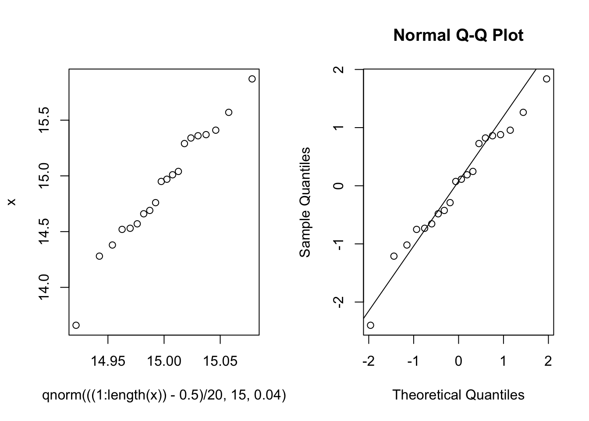

# 分布检验

## Q-Q图


```r
x=read.table("data/ind.txt")
x=x$V1
par(mfrow=c(1,2))
qqplot(qnorm(((1:length(x))-0.5)/20,15,0.04),x)
z=(x-mean(x))/sd(x)
qqnorm(z);qqline(z)
```



## 7.1 Kolmogorov-Smirnov单样本检验

### KS检验


```r
ks.test(x,"pnorm",15,0.2)
```

```
## 
## 	One-sample Kolmogorov-Smirnov test
## 
## data:  x
## D = 0.33943, p-value = 0.0147
## alternative hypothesis: two-sided
```

### 正态性检验


```r
shapiro.test(x)
```

```
## 
## 	Shapiro-Wilk normality test
## 
## data:  x
## W = 0.97442, p-value = 0.8439
```

```r
library(nortest)
lillie.test(x)
```

```
## 
## 	Lilliefors (Kolmogorov-Smirnov) normality test
## 
## data:  x
## D = 0.11599, p-value = 0.6847
```

```r
ad.test(x)
```

```
## 
## 	Anderson-Darling normality test
## 
## data:  x
## A = 0.24208, p-value = 0.7364
```

```r
cvm.test(x)
```

```
## 
## 	Cramer-von Mises normality test
## 
## data:  x
## W = 0.03417, p-value = 0.7708
```

```r
pearson.test(x)
```

```
## 
## 	Pearson chi-square normality test
## 
## data:  x
## P = 3.1, p-value = 0.5412
```

```r
sf.test(x)
```

```
## 
## 	Shapiro-Francia normality test
## 
## data:  x
## W = 0.9683, p-value = 0.6274
```


```r
library(fBasics)
```

```
## Loading required package: timeDate
```

```
## Loading required package: timeSeries
```

```r
normalTest(x)
```

```
## 
## Title:
##  Shapiro - Wilk Normality Test
## 
## Test Results:
##   STATISTIC:
##     W: 0.9744
##   P VALUE:
##     0.8439 
## 
## Description:
##  Wed Aug  3 20:39:09 2022 by user:
```

```r
ksnormTest(x)
```

```
## 
## Title:
##  One-sample Kolmogorov-Smirnov test
## 
## Test Results:
##   STATISTIC:
##     D: 1
##   P VALUE:
##     Alternative Two-Sided: < 2.2e-16 
##     Alternative      Less: < 2.2e-16 
##     Alternative   Greater: 1 
## 
## Description:
##  Wed Aug  3 20:39:09 2022 by user:
```

```r
shapiroTest(x)
```

```
## 
## Title:
##  Shapiro - Wilk Normality Test
## 
## Test Results:
##   STATISTIC:
##     W: 0.9744
##   P VALUE:
##     0.8439 
## 
## Description:
##  Wed Aug  3 20:39:09 2022 by user:
```

```r
jarqueberaTest(x)
```

```
## 
## Title:
##  Jarque - Bera Normalality Test
## 
## Test Results:
##   STATISTIC:
##     X-squared: 0.4222
##   P VALUE:
##     Asymptotic p Value: 0.8097 
## 
## Description:
##  Wed Aug  3 20:39:09 2022 by user:
```

```r
dagoTest(x)
```

```
## 
## Title:
##  D'Agostino Normality Test
## 
## Test Results:
##   STATISTIC:
##     Chi2 | Omnibus: 0.9747
##     Z3  | Skewness: -0.79
##     Z4  | Kurtosis: 0.5922
##   P VALUE:
##     Omnibus  Test: 0.6142 
##     Skewness Test: 0.4295 
##     Kurtosis Test: 0.5537 
## 
## Description:
##  Wed Aug  3 20:39:09 2022 by user:
```


## 7.2 Kolmogorov-Smirnov两样本分布检验


```r
z=read.table("data/ks2.txt",header=F);
(x=z[z[,2]==1,1]);(y=z[z[,2]==2,1])
```

```
##  [1] 5.38 4.38 9.33 3.66 3.72 1.66 0.23 0.08 2.36 1.71 2.01 0.90 1.54
```

```
##  [1]  6.67 16.21 11.93  9.85 10.43 13.54  2.40 12.89  9.30 11.92  5.74 14.45
## [13]  1.99  9.14  2.89
```

```r
ks.test(x,y)
```

```
## 
## 	Two-sample Kolmogorov-Smirnov test
## 
## data:  x and y
## D = 0.72308, p-value = 0.0004714
## alternative hypothesis: two-sided
```

**拟合优度$\chi^2$检验**


## 7.3 Pearson $\chi^2$ 拟合优度检验


```r
Ob=c(490,334,68,16);n=sum(Ob);
lambda=c(t(0:3)%*%Ob/n)
p=exp(-lambda)*lambda^(0:3)/factorial(0:3)
E=p*n;
Q=sum((E-Ob)^2/E);
pvalue=pchisq(Q,2,low=F)
```


### Goodness-of-Fit Tests for a Single Discrete Random Variable


```r
#Suppose we roll a die n = 370 times 
#and we observe the frequencies (58, 55, 62, 68, 66, 61). 
#Suppose we are interested in testing to see if the die is fair;
#i.e., p(j) ≡ 1/6.
x <- c(58,55,62,68,66,61)
chifit <- chisq.test(x)
chifit
```

```
## 
## 	Chi-squared test for given probabilities
## 
## data:  x
## X-squared = 1.9027, df = 5, p-value = 0.8624
```

```r
round(chifit$expected,digits=4)
```

```
## [1] 61.6667 61.6667 61.6667 61.6667 61.6667 61.6667
```

```r
round((chifit$residuals)^2,digits=4)
```

```
## [1] 0.2180 0.7207 0.0018 0.6505 0.3045 0.0072
```


```r
#(Birth Rate of Males to Swedish Ministers). 
#This data is discussed on page 266 of Daniel (1978). 
#It concerns the number of males in the first seven children 
#for n = 1334 Swedish ministers of religion.
oc<-c(6,57,206,362,365,256,69,13)
n<-sum(oc)
range<-0:7
phat<-sum(range*oc)/(n*7)
pmf<-dbinom(range,7,phat)
rbind(range,round(pmf,3))
```

```
##        [,1]  [,2] [,3]  [,4] [,5]  [,6]  [,7]  [,8]
## range 0.000 1.000 2.00 3.000 4.00 5.000 6.000 7.000
##       0.006 0.047 0.15 0.265 0.28 0.178 0.063 0.009
```

```r
test.result<-chisq.test(oc,p=pmf)
pchisq(test.result$statistic,df=6,lower.tail=FALSE)
```

```
## X-squared 
## 0.4257546
```

```r
round(test.result$expected,1)
```

```
## [1]   8.5  63.2 200.6 353.7 374.1 237.4  83.7  12.6
```


### Several Discrete Random Variables


```r
#(Type of Crime and Alcoholic Status). 
#The contingency table, Table 2.1, 
#contains the frequencies of criminals who committed certain crimes and whether or not they are alcoholics. 
#We are interested in seeing whether or not the distribution of alcoholic status is the same for each type of crime.
#The data were obtained from Kendall and Stuart (1979).
c1 <- c(50,88,155,379,18,63)
c2 <- c(43,62,110,300,14,144)
ct <- cbind(c1,c2)
chifit <- chisq.test(ct)
chifit
```

```
## 
## 	Pearson's Chi-squared test
## 
## data:  ct
## X-squared = 49.731, df = 5, p-value = 1.573e-09
```

```r
(chifit$residuals)^2 #residuals=(observed - expected) / sqrt(expected)
```

```
##               c1          c2
## [1,]  0.01617684  0.01809979
## [2,]  0.97600214  1.09202023
## [3,]  1.62222220  1.81505693
## [4,]  1.16680759  1.30550686
## [5,]  0.07191850  0.08046750
## [6,] 19.61720859 21.94912045
```

```r
ct2 <- ct[-6,]
chisq.test(ct2)
```

```
## 
## 	Pearson's Chi-squared test
## 
## data:  ct2
## X-squared = 1.1219, df = 4, p-value = 0.8908
```


