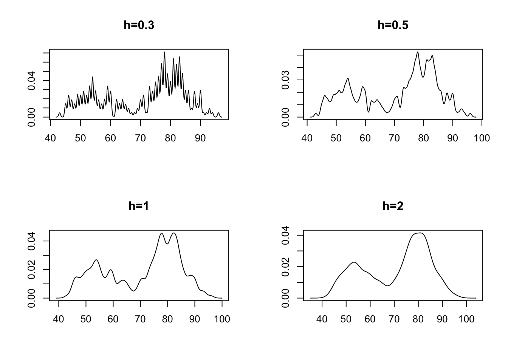
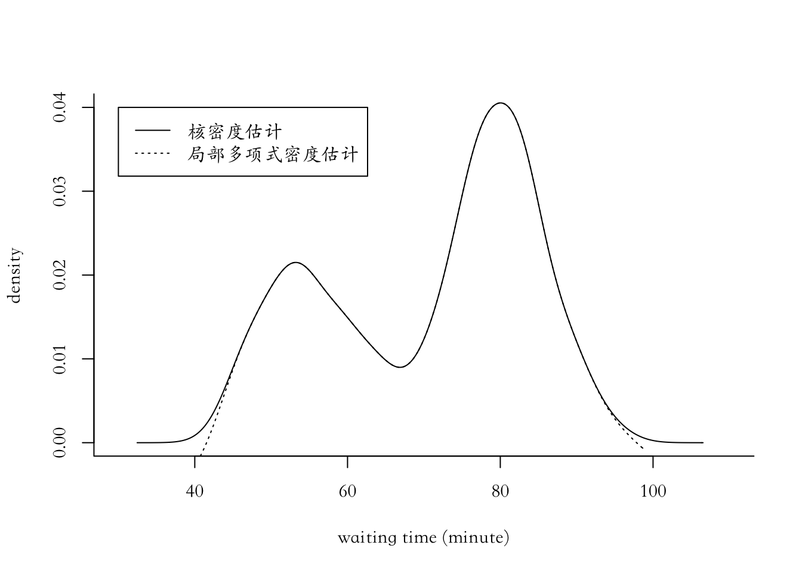
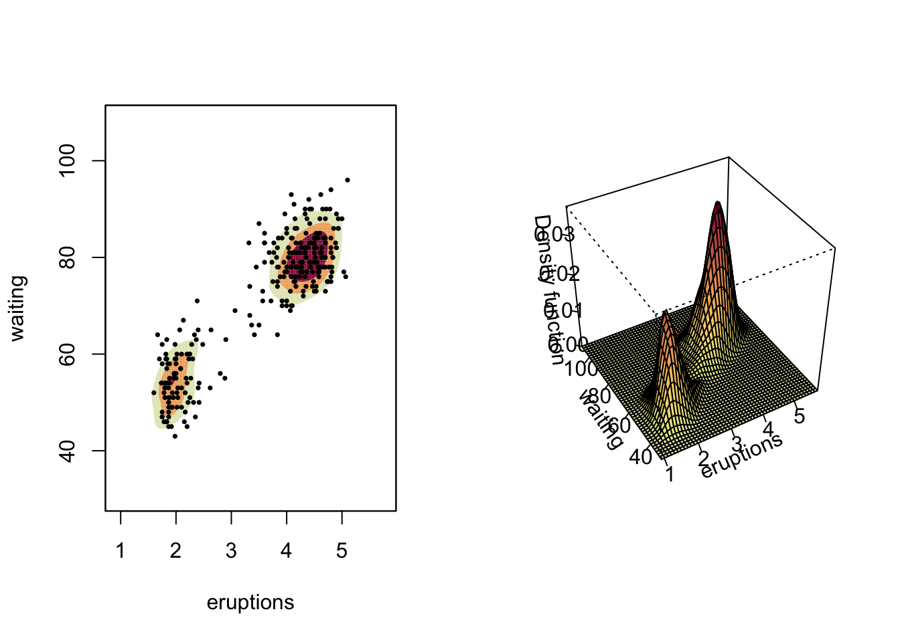
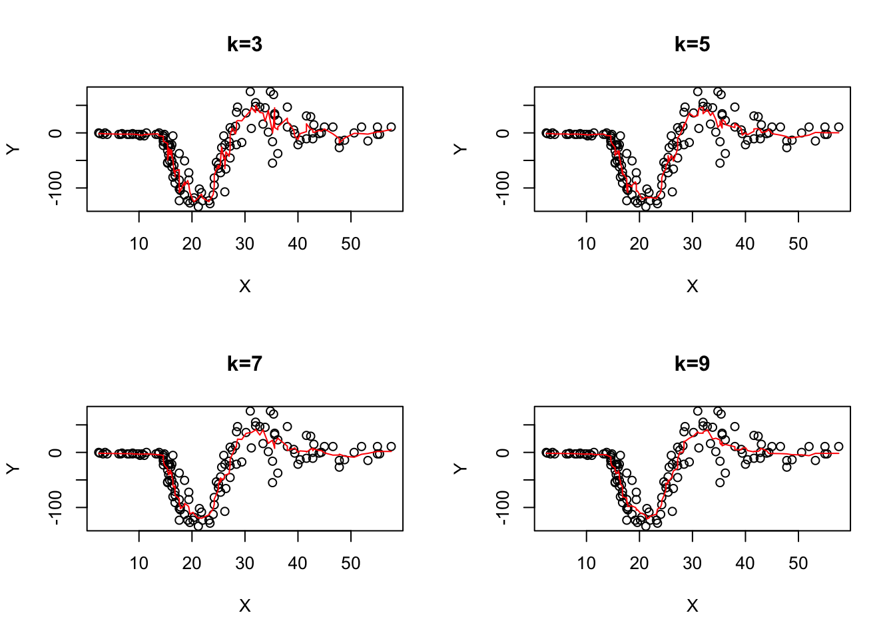

# 密度估计和回归

## 非参数密度估计

### 一元密度估计

#### **核密度估计**


```r
par(mfrow=c(2,2));
x=faithful$waiting;
library(KernSmooth);
```

```
## KernSmooth 2.23 loaded
## Copyright M. P. Wand 1997-2009
```

```r
w=bkde(x,band=0.3);plot(w,type="l",main="h=0.3",xlab="",ylab="");
w=bkde(x,band=0.5);plot(w,type="l",main="h=0.5",xlab="",ylab="");
w=bkde(x,band=1);plot(w,type="l",main="h=1",xlab="",ylab="");
w=bkde(x, band=2);plot(w,type="l",main="h=2",xlab="",ylab="")
```



#### **局部多项式密度估计**


```r
par(mfrow=c(1,1));
x=faithful$waiting;
library(KernSmooth)
par(family='STKaiti')
plot(x=c(30,110),y=c(0,0.04),type ="n",bty="l",xlab="waiting time (minute)",ylab ="density")
lines(bkde(x,bandwidth=dpik(x)))
lines(locpoly(x,bandwidth=dpik(x)),lty=3)
legend(30,0.04,legend = c("核密度估计","局部多项式密度估计"),lty = c(1,3))
```



#### **k近邻估计**

### 多元密度估计


```r
library(ks);
par(mfrow=c(1,2));
fhat<- kde(faithful)
plot(fhat, display="filled.contour2")
points(faithful, cex=0.5, pch=16)
plot(fhat, display="persp")
```



## 非参数回归

#### **滑动平均（k近邻光滑）**


```r
library(spatstat);
library(MASS)
X=mcycle[,1];
Y=mcycle[,2];
m=nnwhich(X,k=1:8);
z3=z5=z7=z9=Y;
for (j in 1:2) z3=cbind(z3,Y[m[,j]])
for (j in 1:4) z5=cbind(z5,Y[m[,j]])
for (j in 1:6) z7=cbind(z7,Y[m[,j]])
for (j in 1:8) z9=cbind(z9,Y[m[,j]])
par(mfrow=c(2,2));mtx=list("k=3","k=5","k=7","k=9")
plot(X,Y,main=mtx[[1]]);points(X,apply(z3,1,mean),type="l",col='red')
plot(X,Y,main=mtx[[2]]);points(X,apply(z5,1,mean),type="l",col='red')
plot(X,Y,main=mtx[[3]]);points(X,apply(z7,1,mean),type="l",col='red')
plot(X,Y,main=mtx[[4]]);points(X,apply(z9,1,mean),type="l",col='red')
```



#### **核回归光滑**


```r
library(MASS);par(mfrow=c(2,2));X=mcycle[,1];Y=mcycle[,2]
bw=list("lam=1", "h=2", "h=3", "h=5")
plot(X,Y,main=bw[[1]]);lines(ksmooth(X,Y,"normal",bandwidth=1),col='red')
plot(X,Y,main=bw[[2]]);lines(ksmooth(X,Y,"normal",bandwidth=2),col='red')
plot(X,Y,main=bw[[3]]);lines(ksmooth(X,Y,"normal",bandwidth=3),col='red')
plot(X,Y,main=bw[[4]]);lines(ksmooth(X,Y,"normal",bandwidth=5),col='red')
```


#### **Loess局部加权多项式回归**

Loess: locally weighted polynomial regression

Lowess: locally weighted scatter plot smoothing

#### **光滑样条**

smoothing spline


```r
library(MASS);par(mfrow=c(2,2))
bw=list("lambda=0.01", "lambda=0.001", "lambda=0.0001", "lambda=0.000001")
plot(X,Y,main=bw[[1]]);lines(smooth.spline(X,Y,lambda=0.01),col='red')
plot(X,Y,main=bw[[2]]);lines(smooth.spline(X,Y,lambda=0.001),col='red')
plot(X,Y,main=bw[[3]]);lines(smooth.spline(X,Y,lambda=0.0001),col='red')
plot(X,Y,main=bw[[4]]);lines(smooth.spline(X,Y,lambda=0.000001),col='red')
```


#### **Firedman超光滑法**

Friedman's Supersmoother


```r
library(MASS);
attach(mcycle);
par(mfrow=c(2,2));
plot(accel~times,mcycle,main="Lowess");
lines(lowess(mcycle,f=.1),col='red');
fit1=loess(accel~times,mcycle,span=.15);
pred1=predict(fit1,data.frame(times=seq(0,60,length=160)),se=TRUE);
plot(accel~times,mcycle,main="Loess");
lines(seq(0,60,length=160),pred1$fit,col='red');
plot(accel~times,mcycle,main="Friedman's SuperSmoother");
lines(supsmu(times,accel),col='red')
plot(accel~times,mcycle,main="Smoothing Spline");
lines(ksmooth(times,accel,"normal",bandwidth=2),col='red')
```


