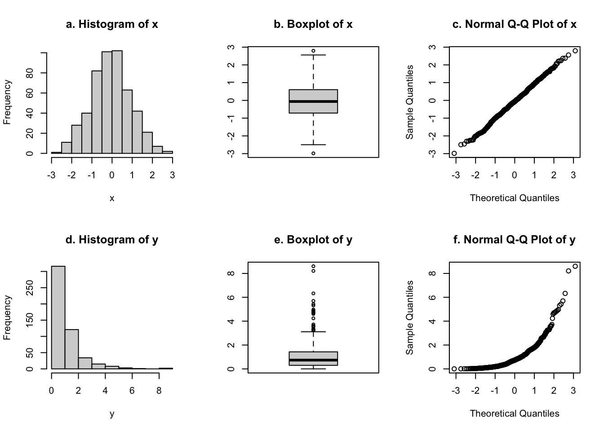
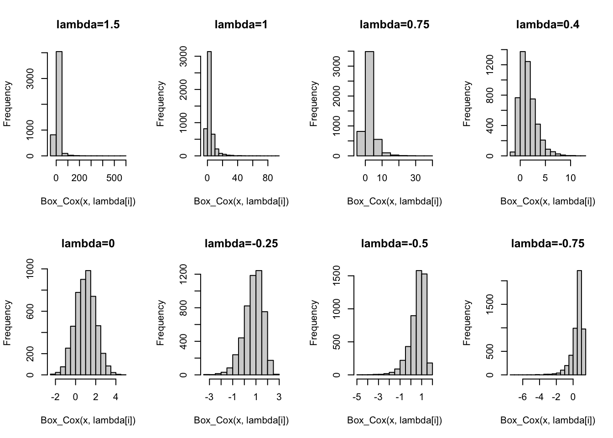

# 概述

## 习题1: (1.5 数据可视化，查看对总体分布的假设是否合理)

  - 直方图
  - 箱线图
  - QQ图(quantile-quantile plots): 由从小到大排序的样本点和标准总体分布的分位点($\Phi^{-1}[(i-3/8)/(n+1/4)]$)所作散点图 


```r
x=rnorm(500)
y=rexp(500,1)
par(mfrow=c(2,3))
hist(x,main="a. Histogram of x")
boxplot(x,main="b. Boxplot of x")
qqnorm(x,main="c. Normal Q-Q Plot of x")
hist(y,main="d. Histogram of y")
boxplot(y,main="e. Boxplot of y")
qqnorm(y,main="f. Normal Q-Q Plot of y")
```



## 数据变换（Box-Cox变换）

$$y= \left\{ \begin{align} (x^\lambda-1)/\lambda && \lambda \neq 0; \\ log x && \lambda=0. \end{align} \right.$$


```r
x = exp(rnorm(5000,1))
lambda = c(1.5,1,0.75,0.4,0,-0.25,-0.5,-0.75)
Box_Cox <- function(x,lambda){
  if(lambda==0){return(log(x))}
  else{return((x^lambda-1)/lambda)}
}
par(mfrow=c(2,4))
for(i in 1:8){
  hist(Box_Cox(x,lambda[i]),main=paste0(expression(lambda),"=",lambda[i]))
}
```



## 2.(1)


```r
pnorm(2.1,1000,1) #H1为真时，X<2.1的概率
```

```
## [1] 0
```

```r
pnorm(2.1,low=F) #H0为真时，X>2.1的概率
```

```
## [1] 0.01786442
```

```r
1-pnorm(2.1)
```

```
## [1] 0.01786442
```

## 2.(2)


```r
x=c(rep(100,6), rep(99,4));
y=c(50,0)
t.test(x,mu=100,alt="less")
```

```
## 
## 	One Sample t-test
## 
## data:  x
## t = -2.4495, df = 9, p-value = 0.01839
## alternative hypothesis: true mean is less than 100
## 95 percent confidence interval:
##      -Inf 99.89935
## sample estimates:
## mean of x 
##      99.6
```

```r
t.test(y,mu=100,alt="less")
```

```
## 
## 	One Sample t-test
## 
## data:  y
## t = -3, df = 1, p-value = 0.1024
## alternative hypothesis: true mean is less than 100
## 95 percent confidence interval:
##      -Inf 182.8438
## sample estimates:
## mean of x 
##        25
```

