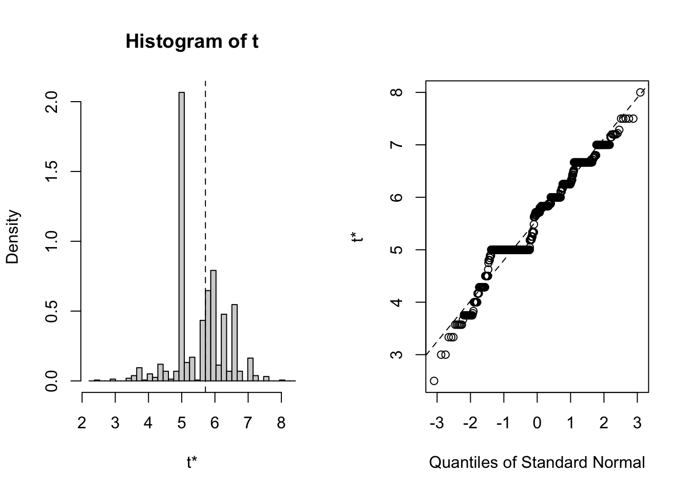

# Bootstrap


```r
x<-rnorm(25,30,5)
B<-1000 # number of bootstrap samples to obtain
xbar<-rep(0,B)
for( i in 1:B ){
xbs<-sample(x,length(x),replace=TRUE)
xbar[i]<-mean(xbs)
}
se.xbar<-sd(xbar)
se.xbar
```

```
## [1] 0.8517539
```

```r
tcv<-qt(0.975,length(x)-1)
mean(x)+c(-1,1)*tcv*se.xbar
```

```
## [1] 29.82139 33.33726
```

```r
mean(x)+c(-1,1)*tcv*sd(x)/sqrt(length(x))
```

```
## [1] 29.75436 33.40429
```
 

## Percentile Bootstrap Confidence Intervals


```r
quantile(xbar,probs=c(0.025,0.975),type=1)
```

```
##     2.5%    97.5% 
## 29.88558 33.17631
```

```r
m<-0.025*1000
sort(xbar)[c(m,B-m)]
```

```
## [1] 29.88558 33.17631
```

```r
library("boot")
bsxbar<-boot(x,function(x,indices) mean(x[indices]), B)
boot.ci(bsxbar)
```

```
## Warning in boot.ci(bsxbar): bootstrap variances needed for studentized intervals
```

```
## BOOTSTRAP CONFIDENCE INTERVAL CALCULATIONS
## Based on 1000 bootstrap replicates
## 
## CALL : 
## boot.ci(boot.out = bsxbar)
## 
## Intervals : 
## Level      Normal              Basic         
## 95%   (29.97, 33.18 )   (30.03, 33.24 )  
## 
## Level     Percentile            BCa          
## 95%   (29.92, 33.13 )   (29.85, 33.08 )  
## Calculations and Intervals on Original Scale
```

```r
quantile(bsxbar$t,probs=c(0.025,0.975),type=1)
```

```
##     2.5%    97.5% 
## 29.92193 33.12238
```
 
## Bootstrap Tests of Hypotheses

### Nursery School Intervention


```r
school<-c(82,69,73,43,58,56,76,65)
home<-c(63,42,74,37,51,43,80,62)
d <- school - home
dpm<-c(d,-d)
n<-length(d)
B<-5000
dbs<-matrix(sample(dpm,n*B,replace=TRUE),ncol=n)
wilcox.teststat<-function(x) wilcox.test(x)$statistic
bs.teststat<-apply(dbs,1,wilcox.teststat)
mean(bs.teststat>=wilcox.teststat(d))
#[1] 0.0238
```

### Bootstrap test for sample mean


```r
x<-rnorm(25,1.5,1)
thetahat<-mean(x)
x0<-x-thetahat+1 #theta0 is 1
mean(x0) # notice H0 is true
```

```
## [1] 1
```

```r
B<-5000
xbar<-rep(0,B)
for( i in 1:B ) {
xbs<-sample(x0,length(x),replace=TRUE)
xbar[i]<-mean(xbs)
}
mean(xbar>=thetahat)
```

```
## [1] 0.0092
```


```r
library(Rfit)
boot.rfit<-function(data,indices){
data<-data[indices,]
fit<-rfit(weight~height,data=data,tau='N')
coefficients(fit)[2]
}

bb.boot<-boot(data=baseball,statistic=boot.rfit,R=1000)
bb.boot
```

```
## 
## ORDINARY NONPARAMETRIC BOOTSTRAP
## 
## 
## Call:
## boot(data = baseball, statistic = boot.rfit, R = 1000)
## 
## 
## Bootstrap Statistics :
##     original     bias    std. error
## t1* 5.714286 -0.1405727   0.7748821
```

```r
plot(bb.boot)
```



```r
boot.ci(bb.boot,type='perc',index=1)
```

```
## BOOTSTRAP CONFIDENCE INTERVAL CALCULATIONS
## Based on 1000 bootstrap replicates
## 
## CALL : 
## boot.ci(boot.out = bb.boot, type = "perc", index = 1)
## 
## Intervals : 
## Level     Percentile     
## 95%   ( 3.75,  7.00 )  
## Calculations and Intervals on Original Scale
```
 
 
 
 
 
 
 
 
 
