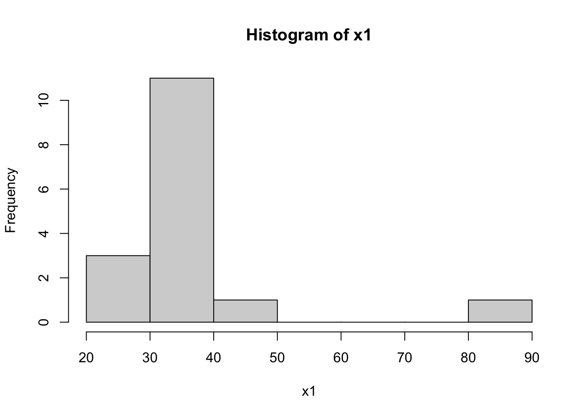
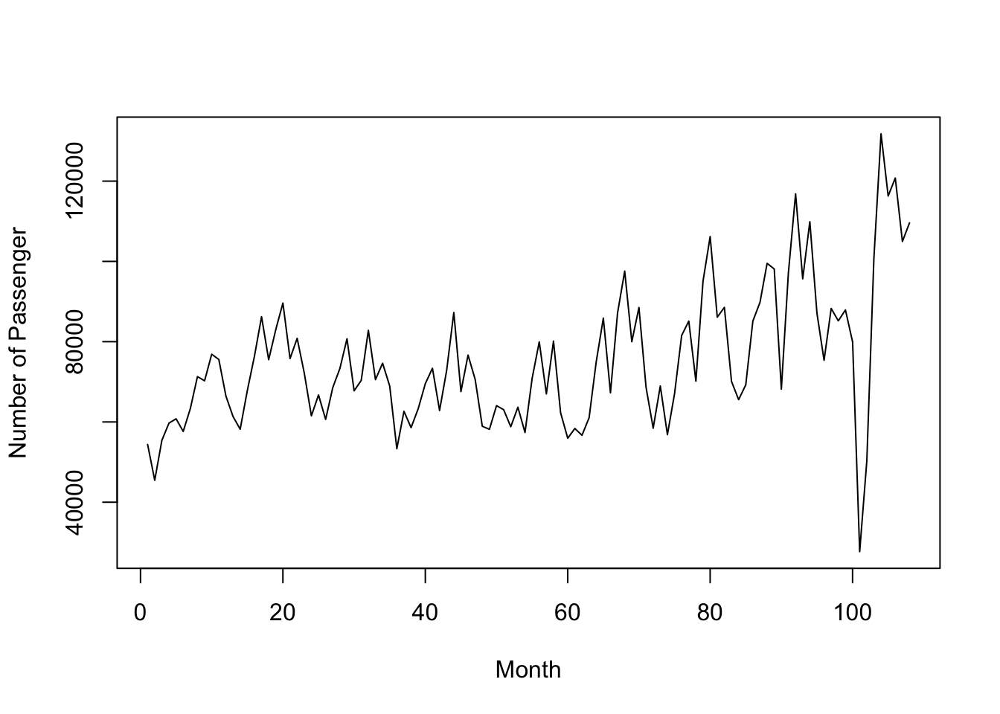

# 单样本位置参数

## 引入的例子：楼盘均价


```r
##数据
x1 <- c(36, 32, 31, 25, 28, 36, 40, 32, 41, 26, 35, 35, 32, 87, 33, 35)
##单样本t检验
t.test(x1,mu=37)
```

```
## 
## 	One Sample t-test
## 
## data:  x1
## t = -0.14123, df = 15, p-value = 0.8896
## alternative hypothesis: true mean is not equal to 37
## 95 percent confidence interval:
##  28.95415 44.04585
## sample estimates:
## mean of x 
##      36.5
```

```r
##直方图
hist(x1)
```




```r
##向量计算
x1-37
```

```
##  [1]  -1  -5  -6 -12  -9  -1   3  -5   4 -11  -2  -2  -5  50  -4  -2
```

```r
(x1<37)
```

```
##  [1]  TRUE  TRUE  TRUE  TRUE  TRUE  TRUE FALSE  TRUE FALSE  TRUE  TRUE  TRUE
## [13]  TRUE FALSE  TRUE  TRUE
```

```r
##sign test
library(BSDA)
```

```
## Loading required package: lattice
```

```
## 
## Attaching package: 'BSDA'
```

```
## The following object is masked from 'package:datasets':
## 
##     Orange
```

```r
SIGN.test(x1,md=37,alternative="two.sided",conf.level=0.95)
```

```
## 
## 	One-sample Sign-Test
## 
## data:  x1
## s = 3, p-value = 0.02127
## alternative hypothesis: true median is not equal to 37
## 95 percent confidence interval:
##  31.51725 36.00000
## sample estimates:
## median of x 
##          34 
## 
## Achieved and Interpolated Confidence Intervals: 
## 
##                   Conf.Level  L.E.pt U.E.pt
## Lower Achieved CI     0.9232 32.0000     36
## Interpolated CI       0.9500 31.5173     36
## Upper Achieved CI     0.9787 31.0000     36
```

  - 检验统计量$S=\min\{S^+,S^-\}$,$S^+=\#\{X>median\}$,$S^-=\#\{X<median\}$;
  - $n=s^++s^-$;
  - p值=$2P(S\leq s)$，$S \sim B(n,0.5)$
  

```r
2*(1-pbinom(12,16,0.5)) #2P(S>=n-s)=2P(S>=13)=2[1-P(S<=12)]
```

```
## [1] 0.02127075
```

```r
2*pbinom(3,16,0.5) #2P(S<=s)=2P(S<=3)
```

```
## [1] 0.02127075
```


```r
##wilcoxon signed rank test
wilcox.test(x1,mu=37,alternative="two.sided")
```

```
## Warning in wilcox.test.default(x1, mu = 37, alternative = "two.sided"): cannot
## compute exact p-value with ties
```

```
## 
## 	Wilcoxon signed rank test with continuity correction
## 
## data:  x1
## V = 29.5, p-value = 0.04904
## alternative hypothesis: true location is not equal to 37
```

## 2.1 符号检验 Sign Test

### 2.1.1. 广义符号检验

#### SIGN.test只能处理中位数的问题


```r
expens <- read.table(file="data/ExpensCities.TXT")
SIGN.test(expens$V1,md=64,alternative="two.sided",conf.level=0.95)
```

```
## 
## 	One-sample Sign-Test
## 
## data:  expens$V1
## s = 43, p-value = 0.09592
## alternative hypothesis: true median is not equal to 64
## 95 percent confidence interval:
##  63.28094 77.04644
## sample estimates:
## median of x 
##        67.7 
## 
## Achieved and Interpolated Confidence Intervals: 
## 
##                   Conf.Level  L.E.pt  U.E.pt
## Lower Achieved CI     0.9432 63.5000 76.8000
## Interpolated CI       0.9500 63.2809 77.0464
## Upper Achieved CI     0.9681 62.7000 77.7000
```

#### 自定义函数：广义符号检验


```r
sign.test=function(x,p,q0){
  s1=sum(x<q0);s2=sum(x>q0);n=s1+s2
  p1=pbinom(s1,n,p);p2=1-pbinom(s1-1,n,p)
  if (p1>p2){
    m1="One tail test: H1: Q<q0"
  }
  else{
    m1="One tail test: H1: Q>q0"
  }
  p.value=min(p1,p2);m2="Two tails test";p.value2=2*p.value
  if (q0==median(x)){
    p.value=0.5;p.value2=1
  }
  list(Sign.test1=m1, p.values.of.one.tail.test=p.value,
  p.value.of.two.tail.test=p.value2)
}

sign.test(expens$V1,0.5,64)
```

```
## $Sign.test1
## [1] "One tail test: H1: Q>q0"
## 
## $p.values.of.one.tail.test
## [1] 0.04796182
## 
## $p.value.of.two.tail.test
## [1] 0.09592363
```

```r
sign.test(expens$V1,0.25,64)
```

```
## $Sign.test1
## [1] "One tail test: H1: Q<q0"
## 
## $p.values.of.one.tail.test
## [1] 0.005151879
## 
## $p.value.of.two.tail.test
## [1] 0.01030376
```
  - $H_0:Q_{0.25} \geq 64 \leftrightarrow H_1:Q_{0.25} < 64$;
  - 检验统计量$S^-=\#\{X<q_0\}$,$q_0=64$,$n=s^++s^-$;
  - 如果$Q_{0.25} = q_0$，应有$S^- \sim B(n,0.25)$;
  - 如果$s^-$的值较大，说明较多的值比$q_0$小，因此$Q_{0.25} < q_0$;
  - 此时，p值$=P(S\geq s^-)=1-P(S\leq s^--1)$，$S \sim B(n,0.25)$

### 2.1.2 分位点的置信区间

#### 中位数的置信区间


```r
tax <- read.table(file="data/tax.TXT")
(tax <- sort(tax$V1))
```

```
##  [1] 1.00 1.35 1.99 2.05 2.05 2.10 2.30 2.61 2.86 2.95 2.98 3.23 3.73 4.03 4.82
## [16] 5.24 6.10 6.64 6.81 6.86 7.11 9.00
```

```r
SIGN.test(tax,alternative="two.sided",conf.level=0.95)$Confidence.Intervals
```

```
##                   Conf.Level L.E.pt U.E.pt
## Lower Achieved CI     0.9475 2.3000 5.2400
## Interpolated CI       0.9500 2.2861 5.2999
## Upper Achieved CI     0.9831 2.1000 6.1000
```

#### 自定义函数（一）：中位数的置信区间

```r
mci=function(x,alpha=0.05){
  n=length(x)
  b=0
  i=0
  while(b<=alpha/2&i<=floor(n/2)){
    b=pbinom(i,n,.5);
    k1=i;k2=n-i+1;
    a=2*pbinom(k1-1,n,.5);
    i=i+1
  }
  z=c(k1,k2,a,1-a);
  z2="Entire range!"
  if(k1>=1){
    out=list(Confidence.level=1-a,CI=c(x[k1],x[k2]))
  }
  else{
    out=list(Confidence.level=1-2*pbinom(0,n,.5),CI=z2)
  }
  out
}
mci(tax,alpha=0.05)
```

```
## $Confidence.level
## [1] 0.9830995
## 
## $CI
## [1] 2.1 6.1
```

#### 自定义函数（二）：中位数的置信区间

```r
mci2=function(x,alpha=0){
  n=length(x);q=.5
  m=floor(n*q);s1=pbinom(0:m,n,q);s2=pbinom(m:(n-1),n,q,low=F);
  ss=c(s1,s2);nn=length(ss);a=NULL;
  for(i in 0:m){
    b1=ss[i+1];b2=ss[nn-i];b=b1+b2;d=1-b;
  if((b)>1)break
    a=rbind(a,c(b,d,x[i+1],x[n-i]))}
  if(a[1,1]>alpha){
    out="alpha is too small, CI=All range"   
  } 
  else{
    for(i in 1:nrow(a)){
      if(a[i,1]>alpha){out=a[i-1,];break}
    } 
  }
  out
}
mci2(tax,alpha=0.05)
```

```
## [1] 0.01690054 0.98309946 2.10000000 6.10000000
```

#### 分位数的置信区间

```r
qci=function(x,alpha=0.05,q=.25){
  x<-sort(x);n=length(x);a=alpha/2;r=qbinom(a,n,q);
  s=qbinom(1-a,n,q);CL=pbinom(s,n,q)-pbinom(r-1,n,q)
  if (r==0) lo<-NA else lo<-x[r]
  if (s==n) up<-NA else up<-x[s+1]
  list(c("lower limit"=lo,"upper limit"=up,
        "1-alpha"=1-alpha,"true conf"=CL)) 
}
qci(tax,0.05,0.25)
```

```
## [[1]]
## lower limit upper limit     1-alpha   true conf 
##   1.3500000   2.9800000   0.9500000   0.9751605
```

```r
qci(tax,0.06,0.25)
```

```
## [[1]]
## lower limit upper limit     1-alpha   true conf 
##    1.350000    2.950000    0.940000    0.955626
```

## 2.2 Wilcoxon符号秩检验(Wilcoxon Sign Rank)

### 2.2.1 检验


```r
euroalc <- read.table(file="data/EuroAlc10.TXT")
y <- as.numeric(euroalc[1,])
y
```

```
##  [1]  4.12  5.81  7.63  9.74 10.39 11.92 12.32 12.89 13.54 14.45
```

```r
wilcox.test(y-8)
```

```
## 
## 	Wilcoxon signed rank exact test
## 
## data:  y - 8
## V = 46, p-value = 0.06445
## alternative hypothesis: true location is not equal to 0
```

```r
wilcox.test(y-8,exact = F)
```

```
## 
## 	Wilcoxon signed rank test with continuity correction
## 
## data:  y - 8
## V = 46, p-value = 0.06655
## alternative hypothesis: true location is not equal to 0
```

```r
wilcox.test(y-8,alt="greater")
```

```
## 
## 	Wilcoxon signed rank exact test
## 
## data:  y - 8
## V = 46, p-value = 0.03223
## alternative hypothesis: true location is greater than 0
```

```r
wilcox.test(y-12.5,alt="less")
```

```
## 
## 	Wilcoxon signed rank exact test
## 
## data:  y - 12.5
## V = 11, p-value = 0.05273
## alternative hypothesis: true location is less than 0
```

### 2.2.2 置信区间

#### Walsh平均

```r
walsh=NULL;
for(i in 1:10){
  for(j in i:10){
    walsh=c(walsh,(y[i]+y[j])/2)
  }
} 
walsh=sort(walsh)
walsh
```

```
##  [1]  4.120  4.965  5.810  5.875  6.720  6.930  7.255  7.630  7.775  8.020
## [11]  8.100  8.220  8.505  8.685  8.830  8.865  9.010  9.065  9.285  9.350
## [21]  9.675  9.740  9.775  9.975 10.065 10.130 10.260 10.390 10.585 10.830
## [31] 11.030 11.040 11.155 11.315 11.355 11.640 11.640 11.920 11.965 12.095
## [41] 12.120 12.320 12.405 12.420 12.605 12.730 12.890 12.930 13.185 13.215
## [51] 13.385 13.540 13.670 13.995 14.450
```

#### 利用Walsh平均构造置信区间

```r
(k <- qsignrank(0.025,10))
```

```
## [1] 9
```

```r
N <- length(walsh)
c(walsh[k+1],walsh[N-k])
```

```
## [1]  8.02 12.73
```

```r
wilcox.test(y,conf.int = T)$conf.int
```

```
## [1]  7.775 12.890
## attr(,"conf.level")
## [1] 0.95
```

### simulation study

Which of the two tests, the signed-rank Wilcoxon or the t-test, is the more powerful?


```r
power_comparison <- function(mu){
  n = 30; df = 2; nsims = 10000; collwil = rep(0,nsims)
  collt = rep(0,nsims)
  for(i in 1:nsims){
    x = rt(n,df) + mu
    wil = wilcox.test(x)
    collwil[i] = wil$p.value
    ttest = t.test(x)
    collt[i] = ttest$p.value
  }
  powwil = rep(0,nsims); powwil[collwil <= .05] = 1
  powerwil = sum(powwil)/nsims
  powt = rep(0,nsims); powt[collt<= .05] = 1
  powert = sum(powt)/nsims
  list(powerwil,powert)
}
power_comparison(0)
```

```
## [[1]]
## [1] 0.0477
## 
## [[2]]
## [1] 0.0383
```

```r
power_comparison(0.5)
```

```
## [[1]]
## [1] 0.4648
## 
## [[2]]
## [1] 0.2905
```

```r
power_comparison(1)
```

```
## [[1]]
## [1] 0.9222
## 
## [[2]]
## [1] 0.7017
```

## 2.3 正态记分检验*(normal score)

  - 线性符号秩统计量 $S_n^+=\sum_{i=1}^n a_n^+(R_i^+) I(X_i>0)$；
    - $a_n^+(i)=i$时，$S_n^+$为Wilcoxon符号秩统计量$W^+$；
    - $a_n^+(i)=1$时，$S_n^+$为符号秩统计量$S^+$；
  - 线性秩统计量 $S_n=\sum_{i=1}^n c_n(i) a_n(R_i)$；
    - $N=m+n$,$a_N(i)=i$,$c_N(i)=I(i>m)$,则$S_n$为两样本Wilcoxon秩和统计量;
    - 正态记分$S_n=\sum_{i=1}^n \Phi^{-1}\left( \frac{R_i}{n+1} \right)$;
  - 线性秩统计量的一个特例 $S_n=\sum_{i=1}^n a_n^+(R_i^+) sign(X_i)=\sum_{i=1}^n s_i$；
    - 记分函数$a_n^+(i)=\Phi^{-1}\left( \frac{n+1+i}{2n+2} \right)=\Phi^{-1}\left[\frac{1}{2} \left( 1 + \frac{i}{n+1} \right) \right]$,非负
    - 检验$H_0:Me=M_0$,$X_i-M_0$的秩$r_i$,符号正态记分$s_i=a_n^+(r_i) sign(X_i-M_0)=\Phi^{-1}\left[\frac{1}{2} \left( 1 + \frac{r_i}{n+1} \right) \right]sign(X_i-M_0)$


```r
ns=function(x,m0){
  x1=x-m0;r=rank(abs(x1));n=length(x)
  s=qnorm(.5*(1+r/(n+1)))*sign(x1);
  tt=sum(s)/sqrt(sum(s^2));
  list(pvalue.2sided=2*min(pnorm(tt),pnorm(tt,low=F)),Tstat=tt,s=s)
}
ns(y,8)
```

```
## $pvalue.2sided
## [1] 0.05567649
## 
## $Tstat
## [1] 1.913559
## 
## $s
##  [1] -0.6045853 -0.3487557 -0.1141853  0.2298841  0.4727891  0.7478586
##  [7]  0.9084579  1.0968036  1.3351777  1.6906216
```

```r
ns(y,12.5)
```

```
## $pvalue.2sided
## [1] 0.08114229
## 
## $Tstat
## [1] -1.744096
## 
## $s
##  [1] -1.6906216 -1.3351777 -1.0968036 -0.9084579 -0.7478586 -0.3487557
##  [7] -0.1141853  0.2298841  0.4727891  0.6045853
```


## 2.4 Cox-Stuart趋势检验*

  - 判断增长或减少趋势
  - 求差$D_i=x_i-x_{i+c}$的符号来衡量增减
  - 像符号检验一样用到二项分布


```r
TJair <- read.table(file="data/TJAir.TXT")
TJair <- as.vector(t(TJair))
plot.ts(TJair,xlab="Month",ylab="Number of Passenger")
```



```r
D <- TJair[1:54]-TJair[55:108]
Splus <- sum(sign(D)==1)
Sminus <- sum(sign(D)==1)
K <- min(Splus,Sminus)
pbinom(K,54,.5)
```

```
## [1] 0.001919133
```

## 2.5 随机性的游程检验*

  - 判断n重伯努利试验结果是否随机
  - 称连在一起的0或1为游程
  - 游程个数R的条件分布

#### 自定义函数

```r
runs.test0=function(y,cut=0){ 
  if(cut!=0)x=(y>cut)*1 else x=y
  N=length(x);k=1;
  for(i in 1:(N-1))if (x[i]!=x[i+1])k=k+1;r=k;
  m=sum(1-x);n=N-m;
  P1=function(m,n,k){
    2*choose(m-1,k-1)/choose(m+n,n)*choose(n-1,k-1)
  }
  P2=function(m,n,k){
    choose(m-1,k-1)*choose(n-1,k)/choose(m+n,n)
               +choose(m-1,k)*choose(n-1,k-1)/choose(m+n,n)
  }
  r2=floor(r/2);
  if(r2==r/2){
    pv=0;for(i in 1:r2) pv=pv+P1(m,n,i);
    for(i in 1:(r2-1)) pv=pv+P2(m,n,i)
  } 
  else{
    pv=0
    for(i in 1:r2) pv=pv+P1(m,n,i)
    for(i in 1:r2) pv=pv+P2(m,n,i)
  };
  if(r2==r/2) pv1=1-pv+P1(m,n,r2) else pv1=1-pv+P2(m,n,r2);
  z=(r-2*m*n/N-1)/sqrt(2*m*n*(2*m*n-m-n)/(m+n)^2/(m+n-1));
  ap1=pnorm(z);ap2=1-ap1;tpv=min(pv,pv1)*2;
  list(m=m,n=n,N=N,R=r,Exact.pvalue1=pv,
  Exact.pvalue2=pv1,Aprox.pvalue1=ap1,Aprox.pvalue2=ap2,
  Exact.2sided.pvalue=tpv,Approx.2sided.pvalue=min(ap1,ap2)*2)
}
run02 <- read.table(file="data/run02.TXT")
(run02 <- run02$V1)
```

```
##  [1] 12.27  9.92 10.81 11.79 11.87 10.90 11.22 10.80 10.33  9.30  9.81  8.85
## [13]  9.32  8.67  9.32  9.53  9.58  8.94  7.89 10.77
```

```r
runs.test0(run02,median(run02))
```

```
## $m
## [1] 10
## 
## $n
## [1] 10
## 
## $N
## [1] 20
## 
## $R
## [1] 3
## 
## $Exact.pvalue1
## [1] 5.953799e-05
## 
## $Exact.pvalue2
## [1] 0.9999892
## 
## $Aprox.pvalue1
## [1] 0.0001185775
## 
## $Aprox.pvalue2
## [1] 0.9998814
## 
## $Exact.2sided.pvalue
## [1] 0.000119076
## 
## $Approx.2sided.pvalue
## [1] 0.0002371551
```

```r
y <- factor(sign(run02-median(run02)),labels=c(0,1))
```

#### runs.test函数

```r
library(tseries)
```

```
## Registered S3 method overwritten by 'quantmod':
##   method            from
##   as.zoo.data.frame zoo
```

```r
runs.test(y)
```

```
## 
## 	Runs Test
## 
## data:  y
## Standard Normal = -3.6757, p-value = 0.0002372
## alternative hypothesis: two.sided
```

