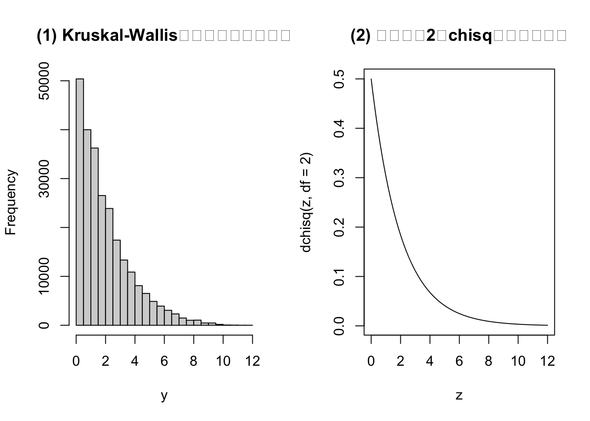
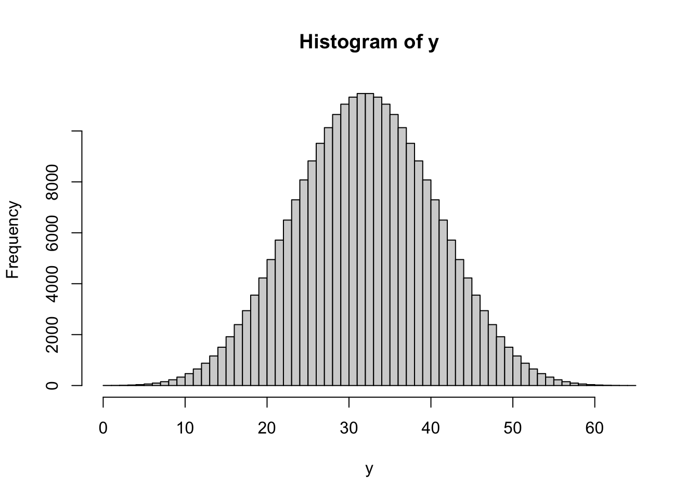
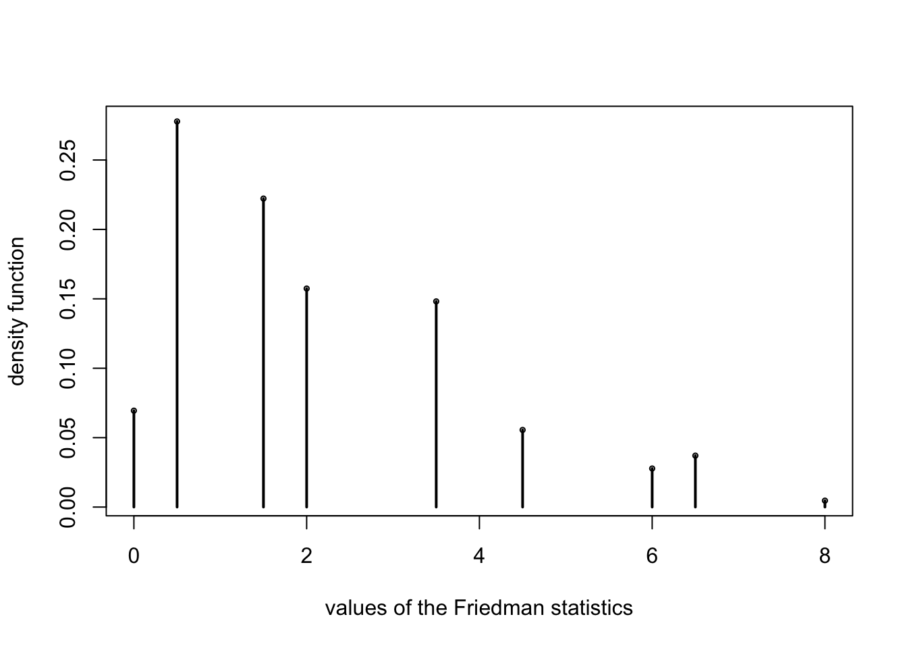
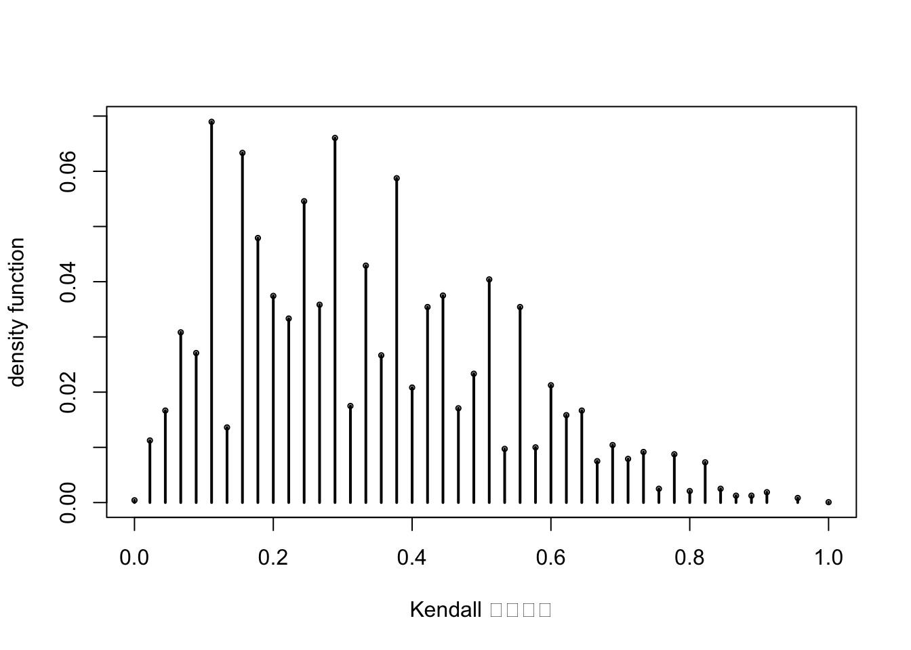
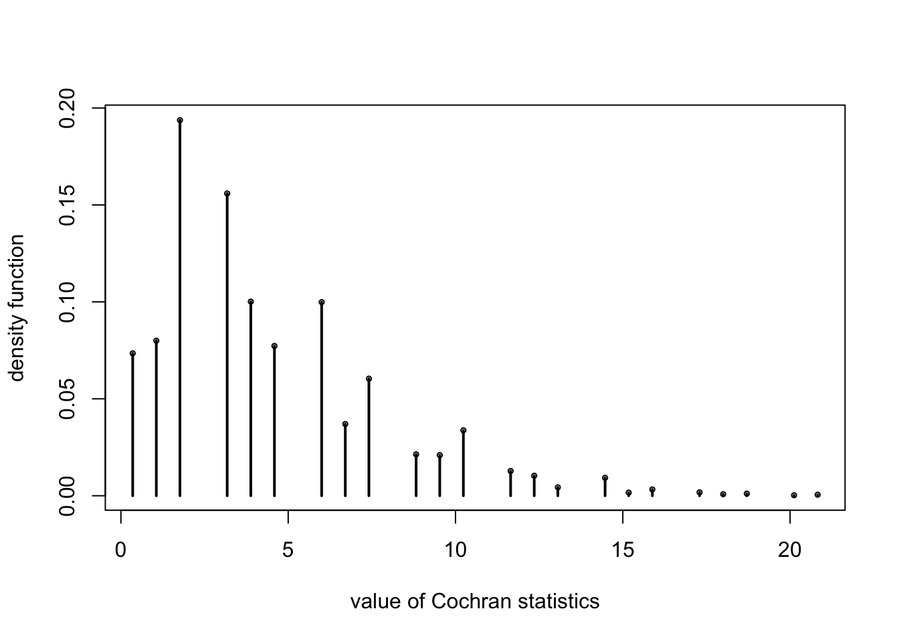
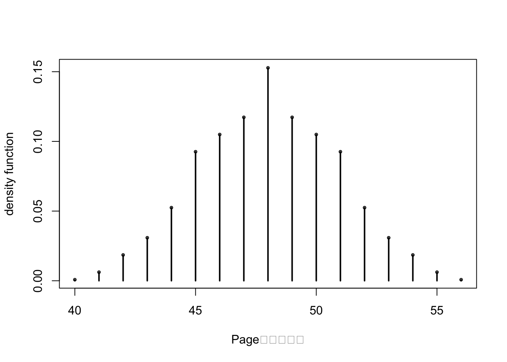
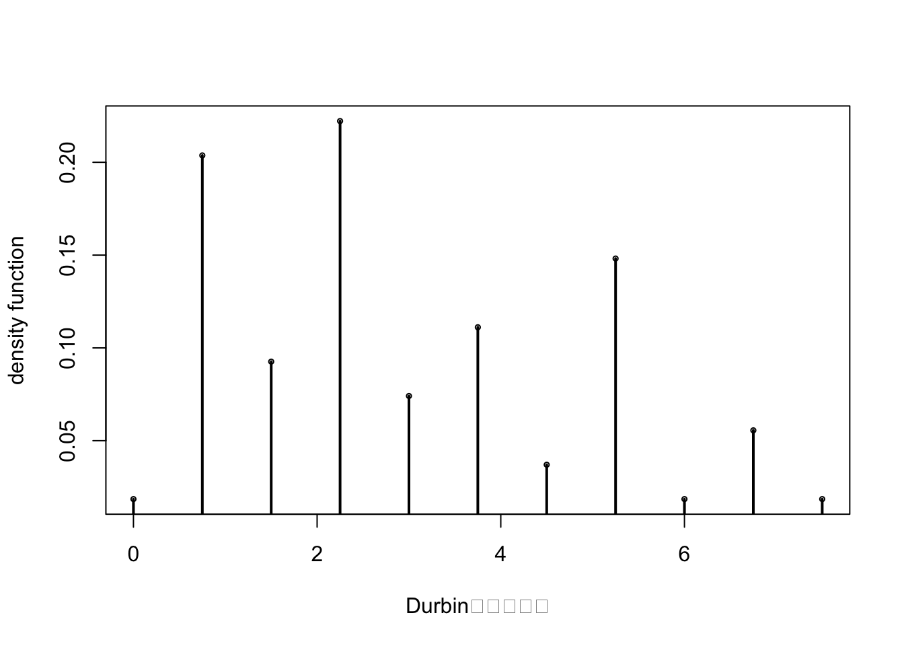

# 多样本位置参数

**单因素问题，独立样本**

## 4.1 Kruskal-Wallis秩和检验

  - 类比于单因素方差分析
  - 不依赖于正态假设和方差齐性假设
  - Wilcoxon秩和检验的推广

### 例：训练方式


```r
A <- c(60, 75, 62, 76, 73, 98, 86)
B <- c(72, 52, 68, 82, 74, 64, 87)
C <- c(61, 85, 78, 66, 70, 59, 69, 79)
D <- c(63, 58, 65, 71, 84, 77, 80, 89)

##kruskal-wallis test
kruskal.test(list(A,B,C,D))
```

```
## 
## 	Kruskal-Wallis rank sum test
## 
## data:  list(A, B, C, D)
## Kruskal-Wallis chi-squared = 0.55369, df = 3, p-value = 0.9069
```


```r
KW.test=function(m1=5,m2=5,m3=4,Hvalue=9.4114){
  # this program is for m1=5, m2=5, and m3 can be any integer
  m<-m1+m2+m3;
  Jh5=function(m){
    a<-rep(0,5)
    for (i in 1:(m-4)){
      for (j in (i+1):(m-3)){
        for (k in (j+1):(m-2)){
          for (l in (k+1):(m-1)){
            for (f in (l+1):m){a<-rbind(a,c(i,j,k,l,f))}
          }
        }
      }
    }
    a[2:nrow(a),]
  }
  JTid1<-Jh5(m1+m2+m3);
  n1<-nrow(JTid1);
  JTid2<-Jh5(m2+m3);
  n2<-nrow(JTid2);
  nn<-n1*n2;
  const<-1:m;
  y<-0
  for (i in 1:n1){
    for (j in 1:n2){
      temp1<-c(JTid1[i,]);
      temp2<-(const[-temp1])[c(JTid2[j,])];
      temp3<-const[-c(temp1,temp2)];
      y<-c(y,12/(m*(m+1))*((sum(temp1))^2/m1+(sum(temp2))^2/m2+(sum(temp3))^2/m3)-3*(m+1))
    }
  }
  y<-y[2:(nn+1)];
  pvalue<-(sum(y>=Hvalue))/nn;
  y<-sort(y);aaa<-aa<-y[1];tempc<-1
  for (i in 2:nn){
    if((y[i]-aa)>10^{-12}){
      aaa<-c(aaa,y[i]);aa<-y[i];tempc<-c(tempc,1-(i-1)/nn)
    }
  }
  out<-cbind(aaa,tempc);z=seq(0,12,0.1);
  par(mfrow=c(1,2))
  hist(y,main="(1) Kruskal-Wallis检验精确分布直方图")
  plot(z,dchisq(z,df=2),type="l",main="(2) 自由度为2的chisq分布密度函数")
  list(c("(m1,m2,m3)"=c(m1,m2,m3),"H"=Hvalue,"pval"=pvalue),out)
}
KW.test() ##time-consuming
```



```
## [[1]]
## (m1,m2,m3)1 (m1,m2,m3)2 (m1,m2,m3)3           H        pval 
## 5.000000000 5.000000000 4.000000000 9.411400000 0.001347858 
## 
## [[2]]
##                 aaa        tempc
##   [1,]  0.005714286 1.000000e+00
##   [2,]  0.020000000 9.938078e-01
##   [3,]  0.042857143 9.878772e-01
##   [4,]  0.051428571 9.759843e-01
##   [5,]  0.085714286 9.698635e-01
##   [6,]  0.111428571 9.578755e-01
##   [7,]  0.131428571 9.462680e-01
##   [8,]  0.142857143 9.345179e-01
##   [9,]  0.180000000 9.286269e-01
##  [10,]  0.202857143 9.230928e-01
##  [11,]  0.222857143 9.121038e-01
##  [12,]  0.225714286 9.008135e-01
##  [13,]  0.271428571 8.897769e-01
##  [14,]  0.280000000 8.791050e-01
##  [15,]  0.325714286 8.736026e-01
##  [16,]  0.360000000 8.625501e-01
##  [17,]  0.371428571 8.517197e-01
##  [18,]  0.385714286 8.411430e-01
##  [19,]  0.462857143 8.205287e-01
##  [20,]  0.500000000 8.050917e-01
##  [21,]  0.522857143 8.002553e-01
##  [22,]  0.542857143 7.904873e-01
##  [23,]  0.545714286 7.806559e-01
##  [24,]  0.591428571 7.711098e-01
##  [25,]  0.600000000 7.520971e-01
##  [26,]  0.691428571 7.424084e-01
##  [27,]  0.705714286 7.377147e-01
##  [28,]  0.725714286 7.287237e-01
##  [29,]  0.751428571 7.195582e-01
##  [30,]  0.771428571 7.107734e-01
##  [31,]  0.782857143 6.926962e-01
##  [32,]  0.842857143 6.836576e-01
##  [33,]  0.862857143 6.751423e-01
##  [34,]  0.865714286 6.665160e-01
##  [35,]  0.965714286 6.580483e-01
##  [36,]  0.980000000 6.537907e-01
##  [37,]  1.000000000 6.497946e-01
##  [38,]  1.002857143 6.416916e-01
##  [39,]  1.011428571 6.256125e-01
##  [40,]  1.045714286 6.174778e-01
##  [41,]  1.071428571 6.095175e-01
##  [42,]  1.140000000 5.940250e-01
##  [43,]  1.182857143 5.865880e-01
##  [44,]  1.185714286 5.790083e-01
##  [45,]  1.285714286 5.716189e-01
##  [46,]  1.300000000 5.533673e-01
##  [47,]  1.322857143 5.465011e-01
##  [48,]  1.331428571 5.395557e-01
##  [49,]  1.345714286 5.322614e-01
##  [50,]  1.365714286 5.253477e-01
##  [51,]  1.411428571 5.183388e-01
##  [52,]  1.422857143 5.115202e-01
##  [53,]  1.482857143 5.045272e-01
##  [54,]  1.551428571 4.979941e-01
##  [55,]  1.560000000 4.916829e-01
##  [56,]  1.605714286 4.851498e-01
##  [57,]  1.620000000 4.788386e-01
##  [58,]  1.642857143 4.697683e-01
##  [59,]  1.651428571 4.578279e-01
##  [60,]  1.685714286 4.547833e-01
##  [61,]  1.711428571 4.487734e-01
##  [62,]  1.731428571 4.428587e-01
##  [63,]  1.742857143 4.368964e-01
##  [64,]  1.802857143 4.308707e-01
##  [65,]  1.825714286 4.252097e-01
##  [66,]  1.871428571 4.196121e-01
##  [67,]  1.962857143 4.142207e-01
##  [68,]  1.971428571 4.089561e-01
##  [69,]  1.985714286 3.979988e-01
##  [70,]  2.005714286 3.928135e-01
##  [71,]  2.031428571 3.820307e-01
##  [72,]  2.051428571 3.769088e-01
##  [73,]  2.062857143 3.715649e-01
##  [74,]  2.100000000 3.690119e-01
##  [75,]  2.142857143 3.640328e-01
##  [76,]  2.191428571 3.538684e-01
##  [77,]  2.245714286 3.491588e-01
##  [78,]  2.280000000 3.441955e-01
##  [79,]  2.305714286 3.393908e-01
##  [80,]  2.351428571 3.348715e-01
##  [81,]  2.371428571 3.304949e-01
##  [82,]  2.382857143 3.260549e-01
##  [83,]  2.420000000 3.216149e-01
##  [84,]  2.442857143 3.194900e-01
##  [85,]  2.462857143 3.066616e-01
##  [86,]  2.465714286 3.021899e-01
##  [87,]  2.511428571 2.981146e-01
##  [88,]  2.520000000 2.940234e-01
##  [89,]  2.565714286 2.918906e-01
##  [90,]  2.600000000 2.876885e-01
##  [91,]  2.625714286 2.837242e-01
##  [92,]  2.691428571 2.797441e-01
##  [93,]  2.740000000 2.756846e-01
##  [94,]  2.782857143 2.720216e-01
##  [95,]  2.785714286 2.682793e-01
##  [96,]  2.831428571 2.573696e-01
##  [97,]  2.840000000 2.537225e-01
##  [98,]  2.885714286 2.500436e-01
##  [99,]  2.931428571 2.463965e-01
## [100,]  2.945714286 2.392607e-01
## [101,]  2.965714286 2.358832e-01
## [102,]  2.991428571 2.324104e-01
## [103,]  3.022857143 2.290804e-01
## [104,]  3.082857143 2.240775e-01
## [105,]  3.102857143 2.209378e-01
## [106,]  3.160000000 2.177029e-01
## [107,]  3.240000000 2.145632e-01
## [108,]  3.242857143 2.114869e-01
## [109,]  3.265714286 2.085534e-01
## [110,]  3.285714286 2.026862e-01
## [111,]  3.311428571 1.996892e-01
## [112,]  3.342857143 1.968666e-01
## [113,]  3.380000000 1.880659e-01
## [114,]  3.402857143 1.867180e-01
## [115,]  3.471428571 1.840540e-01
## [116,]  3.540000000 1.761889e-01
## [117,]  3.571428571 1.736359e-01
## [118,]  3.585714286 1.697747e-01
## [119,]  3.651428571 1.673485e-01
## [120,]  3.742857143 1.623535e-01
## [121,]  3.745714286 1.599432e-01
## [122,]  3.791428571 1.553447e-01
## [123,]  3.800000000 1.530295e-01
## [124,]  3.845714286 1.506351e-01
## [125,]  3.882857143 1.483358e-01
## [126,]  3.891428571 1.439592e-01
## [127,]  3.905714286 1.416441e-01
## [128,]  3.925714286 1.395192e-01
## [129,]  3.951428571 1.372834e-01
## [130,]  3.971428571 1.352536e-01
## [131,]  4.042857143 1.330653e-01
## [132,]  4.062857143 1.310991e-01
## [133,]  4.165714286 1.269762e-01
## [134,]  4.200000000 1.240506e-01
## [135,]  4.202857143 1.221001e-01
## [136,]  4.245714286 1.202607e-01
## [137,]  4.271428571 1.184054e-01
## [138,]  4.291428571 1.148851e-01
## [139,]  4.302857143 1.131725e-01
## [140,]  4.362857143 1.114124e-01
## [141,]  4.382857143 1.097474e-01
## [142,]  4.385714286 1.079873e-01
## [143,]  4.485714286 1.063698e-01
## [144,]  4.500000000 1.048000e-01
## [145,]  4.520000000 1.009308e-01
## [146,]  4.522857143 9.934510e-02
## [147,]  4.531428571 9.785453e-02
## [148,]  4.591428571 9.617367e-02
## [149,]  4.611428571 9.473067e-02
## [150,]  4.660000000 9.311324e-02
## [151,]  4.705714286 9.171781e-02
## [152,]  4.805714286 8.894280e-02
## [153,]  4.842857143 8.824509e-02
## [154,]  4.851428571 8.558109e-02
## [155,]  4.865714286 8.418566e-02
## [156,]  4.885714286 8.293294e-02
## [157,]  4.911428571 7.893694e-02
## [158,]  4.942857143 7.765251e-02
## [159,]  4.980000000 7.636808e-02
## [160,]  5.022857143 7.511536e-02
## [161,]  5.071428571 7.383093e-02
## [162,]  5.125714286 7.267336e-02
## [163,]  5.162857143 7.019964e-02
## [164,]  5.171428571 6.910550e-02
## [165,]  5.185714286 6.785278e-02
## [166,]  5.205714286 6.672692e-02
## [167,]  5.231428571 6.552178e-02
## [168,]  5.262857143 6.445935e-02
## [169,]  5.322857143 6.327006e-02
## [170,]  5.400000000 6.122449e-02
## [171,]  5.445714286 5.905206e-02
## [172,]  5.460000000 5.806892e-02
## [173,]  5.482857143 5.714920e-02
## [174,]  5.491428571 5.621363e-02
## [175,]  5.525714286 5.576170e-02
## [176,]  5.571428571 5.485784e-02
## [177,]  5.582857143 5.205112e-02
## [178,]  5.620000000 5.102041e-02
## [179,]  5.642857143 5.016412e-02
## [180,]  5.665714286 4.930784e-02
## [181,]  5.711428571 4.845155e-02
## [182,]  5.780000000 4.761112e-02
## [183,]  5.802857143 4.721469e-02
## [184,]  5.811428571 4.642183e-02
## [185,]  5.871428571 4.472512e-02
## [186,]  5.902857143 4.321869e-02
## [187,]  5.962857143 4.240997e-02
## [188,]  5.982857143 4.172811e-02
## [189,]  5.985714286 4.093526e-02
## [190,]  6.031428571 4.022168e-02
## [191,]  6.085714286 3.950811e-02
## [192,]  6.100000000 3.796997e-02
## [193,]  6.122857143 3.728811e-02
## [194,]  6.145714286 3.660625e-02
## [195,]  6.165714286 3.527425e-02
## [196,]  6.211428571 3.457653e-02
## [197,]  6.222857143 3.387882e-02
## [198,]  6.282857143 3.354582e-02
## [199,]  6.302857143 3.291153e-02
## [200,]  6.351428571 3.229310e-02
## [201,]  6.405714286 3.053296e-02
## [202,]  6.440000000 2.988282e-02
## [203,]  6.451428571 2.926439e-02
## [204,]  6.485714286 2.864596e-02
## [205,]  6.531428571 2.809096e-02
## [206,]  6.542857143 2.753596e-02
## [207,]  6.602857143 2.696510e-02
## [208,]  6.622857143 2.644181e-02
## [209,]  6.625714286 2.593438e-02
## [210,]  6.671428571 2.542695e-02
## [211,]  6.760000000 2.490367e-02
## [212,]  6.762857143 2.442795e-02
## [213,]  6.771428571 2.398395e-02
## [214,]  6.785714286 2.300081e-02
## [215,]  6.805714286 2.209695e-02
## [216,]  6.831428571 2.165295e-02
## [217,]  6.900000000 2.122481e-02
## [218,]  6.942857143 2.040023e-02
## [219,]  7.000000000 1.909995e-02
## [220,]  7.045714286 1.888588e-02
## [221,]  7.080000000 1.847359e-02
## [222,]  7.105714286 1.806130e-02
## [223,]  7.171428571 1.769659e-02
## [224,]  7.182857143 1.733187e-02
## [225,]  7.220000000 1.690373e-02
## [226,]  7.242857143 1.676102e-02
## [227,]  7.265714286 1.577787e-02
## [228,]  7.311428571 1.542902e-02
## [229,]  7.320000000 1.515944e-02
## [230,]  7.425714286 1.484230e-02
## [231,]  7.445714286 1.423973e-02
## [232,]  7.471428571 1.393844e-02
## [233,]  7.491428571 1.363716e-02
## [234,]  7.502857143 1.301873e-02
## [235,]  7.562857143 1.268573e-02
## [236,]  7.585714286 1.238444e-02
## [237,]  7.631428571 1.160744e-02
## [238,]  7.640000000 1.133787e-02
## [239,]  7.685714286 1.102073e-02
## [240,]  7.720000000 1.073530e-02
## [241,]  7.765714286 1.046572e-02
## [242,]  7.791428571 1.021201e-02
## [243,]  7.822857143 9.783867e-03
## [244,]  7.860000000 9.649081e-03
## [245,]  7.902857143 9.411224e-03
## [246,]  7.905714286 9.189223e-03
## [247,]  8.005714286 8.967223e-03
## [248,]  8.042857143 8.650080e-03
## [249,]  8.051428571 8.491508e-03
## [250,]  8.065714286 8.190222e-03
## [251,]  8.085714286 7.984079e-03
## [252,]  8.131428571 7.762079e-03
## [253,]  8.142857143 7.571793e-03
## [254,]  8.222857143 6.874078e-03
## [255,]  8.225714286 6.699650e-03
## [256,]  8.271428571 6.541078e-03
## [257,]  8.280000000 6.208078e-03
## [258,]  8.340000000 5.779934e-03
## [259,]  8.362857143 5.637220e-03
## [260,]  8.371428571 5.478648e-03
## [261,]  8.385714286 5.320077e-03
## [262,]  8.431428571 5.177362e-03
## [263,]  8.462857143 5.018791e-03
## [264,]  8.522857143 4.796791e-03
## [265,]  8.542857143 4.669933e-03
## [266,]  8.545714286 4.400362e-03
## [267,]  8.682857143 4.273504e-03
## [268,]  8.691428571 4.178361e-03
## [269,]  8.725714286 3.805718e-03
## [270,]  8.751428571 3.678861e-03
## [271,]  8.771428571 3.567861e-03
## [272,]  8.965714286 3.441003e-03
## [273,]  8.980000000 3.298289e-03
## [274,]  9.000000000 3.219003e-03
## [275,]  9.011428571 2.933574e-03
## [276,]  9.025714286 2.838431e-03
## [277,]  9.071428571 2.489574e-03
## [278,]  9.102857143 2.315145e-03
## [279,]  9.162857143 1.966288e-03
## [280,]  9.231428571 1.887002e-03
## [281,]  9.285714286 1.601573e-03
## [282,]  9.322857143 1.411287e-03
## [283,]  9.411428571 1.347858e-03
## [284,]  9.502857143 1.094144e-03
## [285,]  9.505714286 1.030715e-03
## [286,]  9.605714286 9.831438e-04
## [287,]  9.642857143 9.514295e-04
## [288,]  9.651428571 7.135721e-04
## [289,]  9.685714286 6.342863e-04
## [290,]  9.925714286 5.867149e-04
## [291,]  9.985714286 4.281433e-04
## [292,] 10.051428571 3.964290e-04
## [293,] 10.062857143 3.647147e-04
## [294,] 10.100000000 3.171432e-04
## [295,] 10.260000000 2.854289e-04
## [296,] 10.511428571 1.902859e-04
## [297,] 10.520000000 1.744287e-04
## [298,] 10.565714286 1.427144e-04
## [299,] 10.645714286 1.347858e-04
## [300,] 11.022857143 7.135721e-05
## [301,] 11.082857143 5.550006e-05
## [302,] 11.571428571 2.378574e-05
```

```r
#[[1]]
#(m1,m2,m3)1 (m1,m2,m3)2 (m1,m2,m3)3           H        pval 
#5.000000000 5.000000000 4.000000000 9.411400000 0.001347858 
```


### 大样本近似


```r
wtloss <- read.table("data/wtloss.txt")
kruskal.test(wtloss[,1],wtloss[,2])
```

```
## 
## 	Kruskal-Wallis rank sum test
## 
## data:  wtloss[, 1] and wtloss[, 2]
## Kruskal-Wallis chi-squared = 9.4322, df = 2, p-value = 0.00895
```


## 4.2 正态记分检验

  - 单样本、双样本正态记分检验的推广


```r
d=wtloss[order(wtloss[,1]),]
n1=sum(d[,2]==1)
n2=sum(d[,2]==2)
n3=sum(d[,2]==3)
n=nrow(d)
r=rank(d[,1])
w=qnorm(r/(n+1))
z=cbind(d,r,w)
nn=sum(sum(w[z[,2]==1])^2/n1,sum(w[z[,2]==2])^2/n2,sum(w[z[,2]==3])^2/n3)
(Tstat=(n-1)*nn/sum(w^2))
```

```
## [1] 9.078947
```

```r
pchisq(Tstat,3-1,low=F)
```

```
## [1] 0.01067903
```


## 4.3 Jonckheere-Terpstra检验

  - 单边（有序）的备择假设
  - 注意与Cox-Stuart趋势检验的区分

### 精确检验


```r
JT.test=function(m1=5,m2=5,m3=4,JTvalue=59){
  # this program is for m1=5, m2=5, and m3 can be any integer
  m<-m1+m2+m3;
  Jh5=function(m){
    a=rep(0,5)
    for (i in 1:(m-4)){
      for (j in (i+1):(m-3)){
        for (k in (j+1):(m-2)){
          for (l in (k+1):(m-1)){
            for (f in (l+1):m){a<-rbind(a,c(i,j,k,l,f))}
          }
        }
      }
    }
    a[2:nrow(a),]
  };
  JTid1=Jh5(m1+m2+m3);n1=nrow(JTid1)
  JTid2=Jh5(m2+m3);n2=nrow(JTid2);
  const=1:m;
  JT=rep(0,n1*n2)
  for (i in 1:n1){
    for (j in 1:n2){
      temp1<-c(JTid1[i,]);
      temp2=(const[-temp1])[c(JTid2[j,])];
      temp3=const[-c(temp1,temp2)];
      JT[j+(i-1)*n2]<-sum(outer(temp2,temp1,">"))+
        sum(outer(temp3,temp1,">"))+sum(outer(temp3,temp2,">"))
    }
  }
  y=JT;
  pval=(sum(y>=JTvalue))/(n1*n2);hist(y,breaks=min(y):max(y))
  z=c(0,hist(y,breaks=min(y):max(y))$counts)
  list("(m1,m2,m3)"=c(m1,m2,m3),c(JTvalue,pval),
  cbind(min(y):max(y),z,rev(cumsum(rev(z)))/(n1*n2)))}
JT.test()
```



```
## $`(m1,m2,m3)`
## [1] 5 5 4
## 
## [[2]]
## [1] 5.900000e+01 5.272505e-04
## 
## [[3]]
##              z             
##  [1,]  0     0 1.000000e+00
##  [2,]  1     3 1.000000e+00
##  [3,]  2     5 9.999881e-01
##  [4,]  3    10 9.999683e-01
##  [5,]  4    20 9.999286e-01
##  [6,]  5    35 9.998494e-01
##  [7,]  6    60 9.997106e-01
##  [8,]  7    96 9.994727e-01
##  [9,]  8   151 9.990922e-01
## [10,]  9   226 9.984936e-01
## [11,] 10   331 9.975976e-01
## [12,] 11   468 9.962855e-01
## [13,] 12   650 9.944302e-01
## [14,] 13   877 9.918534e-01
## [15,] 14  1162 9.883767e-01
## [16,] 15  1505 9.837702e-01
## [17,] 16  1917 9.778039e-01
## [18,] 17  2393 9.702044e-01
## [19,] 18  2941 9.607179e-01
## [20,] 19  3551 9.490589e-01
## [21,] 20  4226 9.349817e-01
## [22,] 21  4948 9.182286e-01
## [23,] 22  5713 8.986133e-01
## [24,] 23  6499 8.759653e-01
## [25,] 24  7296 8.502014e-01
## [26,] 25  8076 8.212779e-01
## [27,] 26  8824 7.892623e-01
## [28,] 27  9514 7.542814e-01
## [29,] 28 10130 7.165652e-01
## [30,] 29 10647 6.764069e-01
## [31,] 30 11052 6.341991e-01
## [32,] 31 11329 5.903858e-01
## [33,] 32 11471 5.454744e-01
## [34,] 33 11471 5.000000e-01
## [35,] 34 11329 4.545256e-01
## [36,] 35 11052 4.096142e-01
## [37,] 36 10647 3.658009e-01
## [38,] 37 10130 3.235931e-01
## [39,] 38  9514 2.834348e-01
## [40,] 39  8824 2.457186e-01
## [41,] 40  8076 2.107377e-01
## [42,] 41  7296 1.787221e-01
## [43,] 42  6499 1.497986e-01
## [44,] 43  5713 1.240347e-01
## [45,] 44  4948 1.013867e-01
## [46,] 45  4226 8.177140e-02
## [47,] 46  3551 6.501832e-02
## [48,] 47  2941 5.094112e-02
## [49,] 48  2393 3.928215e-02
## [50,] 49  1917 2.979560e-02
## [51,] 50  1505 2.219606e-02
## [52,] 51  1162 1.622980e-02
## [53,] 52   877 1.162330e-02
## [54,] 53   650 8.146615e-03
## [55,] 54   468 5.569827e-03
## [56,] 55   331 3.714539e-03
## [57,] 56   226 2.402360e-03
## [58,] 57   151 1.506430e-03
## [59,] 58    96 9.078223e-04
## [60,] 59    60 5.272505e-04
## [61,] 60    35 2.893931e-04
## [62,] 61    20 1.506430e-04
## [63,] 62    10 7.135721e-05
## [64,] 63     5 3.171432e-05
## [65,] 64     2 1.189287e-05
## [66,] 65     1 3.964290e-06
```

### 大样本近似


```r
d=read.table("data/wtloss.txt")
U=matrix(0,3,3);k=max(d[,2]);
for(i in 1:(k-1)){
  for(j in (i+1):k){
    U[i,j]=sum(outer(d[d[,2]==i,1],d[d[,2]==j,1],"-")<0)+sum(outer(d[d[,2]==i,1],d[d[,2]==j,1],"-")==0)/2;
  }
}
J=sum(U);
ni=NULL;
for(i in 1:k) ni=c(ni,sum(d[,2]==i));
N=sum(ni);
Z=(J-(N^2-sum(ni^2))/4)/sqrt((N^2*(2*N+3)-sum(ni^2*(2*ni+3)))/72);
pnorm(Z,low=F)
```

```
## [1] 0.0009566765
```

 **双因素问题**

## 4.5 完全区组设计：Friedman秩和检验

  - 类比于Randomized Block Design
  - Y是连续的
  - 不依赖于正态假设和方差齐性假设

### 精确检验


```r
Friedman=function(k=3,b=4,W0=0.8125){
  perm=function(n=4){
    A=rbind(c(1,2),c(2,1));
    if (n>=3){
      for (i in 3:n){
        temp=cbind(rep(i,nrow(A)),A);
        for (j in (1:(i-2))){
          temp=rbind(temp,cbind(A[,1:j],rep(i,nrow(A)),A[,(j+1):(i-1)]))
        };
        temp=rbind(temp,cbind(A,rep(i,nrow(A))));A=temp
      };
    };
    A
  }
  B=perm(k); # all possible permutations
  nn=nrow(B);
  ind=rep(1:nn,each=nn^(b-1));
  for (i in 1:(b-1)){
    ind=cbind(ind,rep(rep(1:nn,each=nn^(b-1-i)),nn^(i)))
  };
  nn=nrow(ind);
  y=rep(0,nn);
  for (i in 1:nn){
    R=apply(B[ind[i,],],2,sum);
    y[i]=12/(b*k*(k+1))*sum(R^2)-3*b*(k+1)
  };
  y0=sort(unique(y));
  ycnt=ydnt=NULL;
  for (i in 1:length(y0)){
    ydnt=c(ydnt,length(y[y==y0[i]]));
    ycnt=c(ycnt,length(y[y>=y0[i]]))
  };
  plot(y0,ydnt/nn,cex=0.5,ylab="density function",
  xlab="values of the Friedman statistics");
  for (i in 1:length(y0)) points(c(y0[i],y0[i]),c(ydnt[i]/nn,0),type="l",lwd=2);
  list(t(cbind(W=y0/b/(k-1),Q=y0,density=ydnt/nn,pvalue=ycnt/nn)),
  Pvalue=length(y[y>=(b*(k-1)*W0)])/nn)}
Friedman()
```



```
## [[1]]
##               [,1]      [,2]      [,3]      [,4]      [,5]       [,6]
## W       0.00000000 0.0625000 0.1875000 0.2500000 0.4375000 0.56250000
## Q       0.00000000 0.5000000 1.5000000 2.0000000 3.5000000 4.50000000
## density 0.06944444 0.2777778 0.2222222 0.1574074 0.1481481 0.05555556
## pvalue  1.00000000 0.9305556 0.6527778 0.4305556 0.2731481 0.12500000
##               [,7]       [,8]       [,9]
## W       0.75000000 0.81250000 1.00000000
## Q       6.00000000 6.50000000 8.00000000
## density 0.02777778 0.03703704 0.00462963
## pvalue  0.06944444 0.04166667 0.00462963
## 
## $Pvalue
## [1] 0.04166667
```


### 大样本近似


```r
X=read.table("data/blead.txt")
friedman.test(as.matrix(X))
```

```
## 
## 	Friedman rank sum test
## 
## data:  as.matrix(X)
## Friedman chi-squared = 6.5, df = 2, p-value = 0.03877
```

```r
X=t(X);Y=apply(X,2,rank);R=apply(Y,1,sum);k=nrow(X);b=ncol(X);
Q=12/(b*k*(k+1))*sum(R^2)-3*b*(k+1) #Q=12/(b*k*(k+1))*sum((R-mean(R))^2)
Q
```

```
## [1] 6.5
```

```r
(pvalue=pchisq(Q,k-1,low=F))
```

```
## [1] 0.03877421
```

## 4.6 Kendall协同系数检验

  - 评估或排序是否一致
  - 区组设计，Y为有序整数（排名或分数）
  - 二元变量的Kendall's $\tau$在多元情况的推广
  - 注意与Friedman秩和检验统计量的联系


```r
d=read.table("data/airp35.txt");
R=apply(d,2,sum);b=nrow(d);k=ncol(d);
S=sum((R-b*(k+1)/2)^2);
(W=12*S/b^2/(k^3-k));
```

```
## [1] 0.7333333
```

```r
(Q=W*b*(k-1))
```

```
## [1] 8.8
```


```r
Kendall=function(k=5,b=3,W0=0.733){
  perm=function(n=4){
    A=rbind(c(1,2),c(2,1));
    if (n>=3){
      for (i in 3:n){
        temp=cbind(rep(i,nrow(A)),A);
        for (j in (1:(i-2))){
          temp=rbind(temp,cbind(A[,1:j],rep(i,nrow(A)),A[,(j+1):(i-1)]))
        };
        temp=rbind(temp,cbind(A,rep(i,nrow(A))));A=temp
      };
    };A
  }
  B=perm(k); # all possible permutations
  nn=nrow(B);ind=rep(1:nn,each=nn^(b-1));
  for (i in 1:(b-1)){
    ind=cbind(ind,rep(rep(1:nn,each=nn^(b-1-i)),nn^(i)))
  };
  nn=nrow(ind);y=rep(0,nn);
  for (i in 1:nn){
    R=apply(B[ind[i,],],2,sum);
    y[i]=12/(b*k*(k+1))*sum(R^2)-3*b*(k+1)
  };
  y0=sort(unique(y));
  ycnt=ydnt=NULL;
  for (i in 1:length(y0)){
    ydnt=c(ydnt,length(y[y==y0[i]]));
    ycnt=c(ycnt,length(y[y>=y0[i]]))
  };
  w0=y0/b/(k-1);
  plot(w0,ydnt/nn,cex=0.5,ylab="density function",xlab="Kendall 协同系数");
  for (i in 1:length(y0)) points(c(w0[i],w0[i]),c(ydnt[i]/nn,0),type="l",lwd=2)
  list(t(cbind(W=w0,Q=y0,density=ydnt/nn,pvalue=ycnt/nn)),
  Pvalue=length(y[y>=(b*(k-1)*W0)])/nn)
}
Kendall()
```



```
## [[1]]
##                 [,1]       [,2]       [,3]       [,4]       [,5]       [,6]
## W       0.0000000000 0.02222222 0.04444444 0.06666667 0.08888889 0.11111111
## Q       0.0000000000 0.26666667 0.53333333 0.80000000 1.06666667 1.33333333
## density 0.0004166667 0.01125000 0.01666667 0.03083333 0.02708333 0.06895833
## pvalue  1.0000000000 0.99958333 0.98833333 0.97166667 0.94083333 0.91375000
##               [,7]       [,8]       [,9]      [,10]      [,11]      [,12]
## W       0.13333333 0.15555556 0.17777778 0.20000000 0.22222222 0.24444444
## Q       1.60000000 1.86666667 2.13333333 2.40000000 2.66666667 2.93333333
## density 0.01361111 0.06333333 0.04791667 0.03743056 0.03333333 0.05458333
## pvalue  0.84479167 0.83118056 0.76784722 0.71993056 0.68250000 0.64916667
##              [,13]      [,14]     [,15]      [,16]      [,17]     [,18]
## W       0.26666667 0.28888889 0.3111111 0.33333333 0.35555556 0.3777778
## Q       3.20000000 3.46666667 3.7333333 4.00000000 4.26666667 4.5333333
## density 0.03583333 0.06604167 0.0175000 0.04291667 0.02666667 0.0587500
## pvalue  0.59458333 0.55875000 0.4927083 0.47520833 0.43229167 0.4056250
##              [,19]      [,20]     [,21]      [,22]      [,23]      [,24]
## W       0.40000000 0.42222222 0.4444444 0.46666667 0.48888889 0.51111111
## Q       4.80000000 5.06666667 5.3333333 5.60000000 5.86666667 6.13333333
## density 0.02083333 0.03541667 0.0375000 0.01708333 0.02333333 0.04041667
## pvalue  0.34687500 0.32604167 0.2906250 0.25312500 0.23604167 0.21270833
##               [,25]      [,26]     [,27]     [,28]      [,29]      [,30]
## W       0.533333333 0.55555556 0.5777778 0.6000000 0.62222222 0.64444444
## Q       6.400000000 6.66666667 6.9333333 7.2000000 7.46666667 7.73333333
## density 0.009722222 0.03541667 0.0100000 0.0212500 0.01583333 0.01666667
## pvalue  0.172291667 0.16256944 0.1271528 0.1171528 0.09590278 0.08006944
##              [,31]      [,32]       [,33]       [,34]      [,35]      [,36]
## W       0.66666667 0.68888889 0.711111111 0.733333333 0.75555556 0.77777778
## Q       8.00000000 8.26666667 8.533333333 8.800000000 9.06666667 9.33333333
## density 0.00750000 0.01041667 0.007916667 0.009166667 0.00250000 0.00875000
## pvalue  0.06340278 0.05590278 0.045486111 0.037569444 0.02840278 0.02590278
##               [,37]       [,38]        [,39]        [,40]        [,41]
## W       0.800000000 0.822222222  0.844444444  0.866666667  0.888888889
## Q       9.600000000 9.866666667 10.133333333 10.400000000 10.666666667
## density 0.002083333 0.007291667  0.002500000  0.001250000  0.001250000
## pvalue  0.017152778 0.015069444  0.007777778  0.005277778  0.004027778
##                [,42]        [,43]        [,44]
## W        0.911111111 9.555556e-01 1.000000e+00
## Q       10.933333333 1.146667e+01 1.200000e+01
## density  0.001875000 8.333333e-04 6.944444e-05
## pvalue   0.002777778 9.027778e-04 6.944444e-05
## 
## $Pvalue
## [1] 0.03756944
```

### 大样本近似


```r
d=read.table("data/airp.txt");R=apply(d,2,sum);
b=nrow(d);k=ncol(d);S=sum((R-b*(k+1)/2)^2);
W=12*S/b^2/(k^3-k);pchisq(b*(k-1)*W,k-1,low=F)
```

```
## [1] 0.0003320349
```

## 4.7 Cochran检验

  - 二元响应的数据
  - 解决打结的问题
  - 双样本问题McNemar $\chi^2$检验的推广

### 精确检验


```r
Cochran=function(x){
  Xpchs=function(n=7,k=5){
  #output(n_1,..,n_k)-all possible combination with n_1+...+n_k=n
    temp=cbind(n:0,0:n);
    if (k>=3){
      for (j in 3:k){
        a1=temp[,1:(j-2)];a2=temp[,j-1];temp0=NULL;
        for (i in 1:length(a2)){
          if (j==3) temp0=rbind(temp0,cbind(rep(a1[i],a2[i]+1),a2[i]:0,0:a2[i]))
          if (j>3)  temp0=rbind(temp0,cbind(matrix(rep(a1[i,],a2[i]+1),
          ncol=j-2,byrow=T),a2[i]:0,0:a2[i]))
        }
        temp=temp0
      }
    }
  temp
  }
  Xpchs2=function(n=4,k=2){
  #output: all 0 and 1 columns, with n-k 0s and k- 1s columns
    Xchoose=function(n=4,k=2){
      if (k==0) aa=NULL
      if (k>=1){
        aa=matrix(1:n,ncol=1);m=0;
        if(k>1){
          for(i in 2:k){
            m=m+1;m1=nrow(aa);
            aa=cbind(matrix(rep(aa,each=n),ncol=m),rep(1:n,m1))
            aa=aa[(aa[,m+1]>aa[,m]),]
          }
        }
      };
      aa
    };
    e01=Xchoose(n,k)
    temp=matrix(0,nrow=nrow(e01),ncol=n);
    for (j in 1:nrow(temp)){
      if (k==1) temp[j,e01[j]]=1
      if (k>1) temp[j,e01[j,]]=1
      };
      temp
  }
  n=nrow(x);k=ncol(x);
  L=apply(x,1,sum);R=apply(x,2,sum);N=sum(R);
  Q0=(k*(k-1)*sum((R-mean(R))^2))/(k*N-sum(L^2));
  Ni=NULL;
  for (i in 1:k-1) Ni=c(Ni,sum(L==i));
  Ni=Ni[-1];
  eye0=Xpchs2(k,1);temp0=Xpchs(Ni[1],nrow(eye0));Ri0=temp0%*%eye0;
  prob0=factorial(Ni[1])/apply(factorial(temp0),1,prod)*(1/nrow(eye0))^(Ni[1]);
  if (length(Ni)>1){
    for (i in 2:length(Ni)){
      eye1=Xpchs2(k,i);
      temp1=Xpchs(Ni[i],nrow(eye1));
      Ri1=temp1%*%eye1;
      prob1=factorial(Ni[i])/apply(factorial(temp1),1,prod)*(1/nrow(eye1))^(Ni[i])
      Ri0=matrix(rep(t(Ri0),nrow(Ri1)),byrow=T,ncol=k)+
          matrix(rep(Ri1,each=nrow(Ri0)),ncol=k)
      prob0=rep(prob0,length(prob1))*rep(prob1,each=length(prob0))
    }
  }
  xa=k*(k-1)*apply((Ri0-apply(Ri0,1,mean))^2,1,sum)/(k*N-sum(L^2))
  nn=length(xa);xa0=sort(unique(xa));xacnt=NULL;
  for (i in 1:length(xa0)) xacnt=c(xacnt,length(xa[xa==xa0[i]]));
  plot(xa0,xacnt/nn,cex=0.5,ylab="density function",xlab="value of Cochran statistics");
  for (i in 1:length(xa0)){
    points(c(xa0[i],xa0[i]),c(xacnt[i]/nn,0),type="l",lwd=2)
  }
  list(unique(xa),cbind(rbind(t(x),L),c(R,N)),Q=Q0,
  Exactp=sum(prob0[(xa>=Q0)]),pvalue=pchisq(Q0,k-1,low=F))
}
candid=read.table("data/candid.txt");
Cochran(candid[1:10,])
```



```
## [[1]]
##  [1] 20.8235294 20.1176471 17.2941176 14.4705882 15.1764706 11.6470588
##  [7]  9.5294118 18.7058824 15.8823529 12.3529412 10.2352941  7.4117647
## [13]  6.0000000  3.8823529 18.0000000  6.7058824  8.8235294  4.5882353
## [19]  3.1764706  1.7647059  1.0588235  0.3529412 13.0588235
## 
## [[2]]
##    1 2 3 4 5 6 7 8 9 10   
## V1 0 1 1 0 0 1 1 1 1  1  7
## V2 1 1 0 0 0 1 1 1 1  1  7
## V3 0 1 1 1 1 0 0 0 0  1  5
## V4 0 0 0 0 1 1 0 0 1  0  3
## L  1 3 2 1 2 3 2 2 3  3 22
## 
## $Q
## [1] 3.882353
## 
## $Exactp
## [1] 0.3203803
## 
## $pvalue
## [1] 0.2744513
```

### 大样本近似


```r
x=read.table("data/candid.txt");n=apply(x,2,sum);N=sum(n)
L=apply(x,1,sum);k=dim(x)[2]
(Q=(k*(k-1)*sum((n-mean(n))^2))/(k*N-sum(L^2)))
```

```
## [1] 9.352941
```

```r
(pvalue=pchisq(Q,k-1,low=F))
```

```
## [1] 0.0249484
```

## 4.8 Page检验

  - 备择假设为有序
  - 类比于Jonckheere检验
  - 完全区组设计

### 精确检验


```r
Page=function(k=3,b=4,L0=55){
  perm=function(n=4){
    A=rbind(c(1,2),c(2,1));
    if (n>=3){
      for (i in 3:n){
        temp=cbind(rep(i,nrow(A)),A);
        for (j in (1:(i-2))){
          temp=rbind(temp,cbind(A[,1:j],rep(i,nrow(A)),A[,(j+1):(i-1)]))
        };
        temp=rbind(temp,cbind(A,rep(i,nrow(A))));A=temp
      };
    };
    A
  }
  B=perm(k); # all possible permutations
  nn=nrow(B);ind=rep(1:nn,each=nn^(b-1));
  for (i in 1:(b-1)){
    ind=cbind(ind,rep(rep(1:nn,each=nn^(b-1-i)),nn^(i)))
  };
  nn=nrow(ind);y=rep(0,nn);
  for (i in 1:nn){
    R=apply(B[ind[i,],],2,sum);
    y[i]=sum((1:k)*R)
  };
  y0=sort(unique(y));
  ycnt=NULL;
  for (i in 1:length(y0)) ycnt=c(ycnt, length(y[y==y0[i]]));
  plot(y0,ycnt/nn,cex=0.5,ylab="density function",xlab="Page检验统计量");
  for (i in 1:length(y0)) points(c(y0[i],y0[i]),c(ycnt[i]/nn,0),type="l",lwd=2)
  list(cbind(L=y0,pvalue=ycnt/nn),Pvalue=length(y[y>=L0])/nn)
}
Page()
```



```
## [[1]]
##        L       pvalue
##  [1,] 40 0.0007716049
##  [2,] 41 0.0061728395
##  [3,] 42 0.0185185185
##  [4,] 43 0.0308641975
##  [5,] 44 0.0524691358
##  [6,] 45 0.0925925926
##  [7,] 46 0.1049382716
##  [8,] 47 0.1172839506
##  [9,] 48 0.1527777778
## [10,] 49 0.1172839506
## [11,] 50 0.1049382716
## [12,] 51 0.0925925926
## [13,] 52 0.0524691358
## [14,] 53 0.0308641975
## [15,] 54 0.0185185185
## [16,] 55 0.0061728395
## [17,] 56 0.0007716049
## 
## $Pvalue
## [1] 0.006944444
```

### 大样本近似


```r
d=read.table("data/blead1.txt");rd=apply(d,1,rank)
R=apply(rd,1,sum);(L=sum(R*1:length(R)));k=dim(d)[2];b=dim(d)[1]
```

```
## [1] 55
```

```r
m=b*k*(k+1)^2/4;s=sqrt(b*(k^3-k)^2/144/(k-1));Z=(L-m)/s
pnorm(Z,low=F)
```

```
## [1] 0.006664164
```

```r
#library(concord)
#page.trend.test(d)
```

## 4.9 Durbin检验

  - 不完全区组设计
  - 与Friedman检验相似

### 精确检验


```r
Durbin=function(k=4,t=3,b=4,r=3,D0=6.75){
  B=cbind(c(1,2,3),c(1,3,2),c(2,1,3),c(2,3,1),c(3,1,2),c(3,2,1))
  nn=6^b;
  Numfunc=function(r,b,nnum){
    ind=rep(0,b);temp=nnum;
    for (i in 1:b){
      ind[i]=floor(temp/(6^(b-i)))
      temp=temp-ind[i]*6^(b-i)
    };
    ind
  };
  y=0;for (i in 0:(nn-1)){
    A=B[,Numfunc(r,b,i)+1]
    R=c(sum(A[1,1:3]),sum(A[2,1:2])+A[1,4],A[3,1]+sum(A[2,3:4]),sum(A[3,2:4]))
    y=c(y,12*(k-1)/(r*k*(t^2-1))*sum((R-r*(t+1)/2)^2))
  };
  y=y[2:length(y)];
  pvalue=sum(y>=D0)/nn;y0=sort(unique(y));
  ycnt=NULL;
  for (i in 1:length(y0)) ycnt=c(ycnt, length(y[y==y0[i]]));
  plot(y0,ycnt/nn,cex=0.5,ylab="density function",xlab="Durbin检验统计量");
  for (i in 1:length(y0)) points(c(y0[i],y0[i]),c(ycnt[i]/nn,0),type="l",lwd=2)
  list(cbind("k"=k,"b"=b,"r"=r,"t"=t,"pvalue"=pvalue),cbind(y0,ycnt))
}
Durbin()
```



```
## [[1]]
##      k b r t     pvalue
## [1,] 4 4 3 3 0.07407407
## 
## [[2]]
##         y0 ycnt
##  [1,] 0.00   24
##  [2,] 0.75  264
##  [3,] 1.50  120
##  [4,] 2.25  288
##  [5,] 3.00   96
##  [6,] 3.75  144
##  [7,] 4.50   48
##  [8,] 5.25  192
##  [9,] 6.00   24
## [10,] 6.75   72
## [11,] 7.50   24
```

### 大样本近似


```r
d=read.table("data/mater.txt");
k=max(d[,2]);b=max(d[,3]);t=length(d[d[,3]==1,1]);
r=length(d[d[,2]==1,1]);
R=d;for(i in 1:b) R[d[,3]==i,1]=rank(d[d[,3]==i,1]);
RV=NULL;for(i in 1:k) RV=c(RV,sum(R[R[,2]==i,1]));
D=12*(k-1)/(r*k*(t^2-1))*sum((RV-r*(t+1)/2)^2);
pvalue.chi=pchisq(D,k-1,low=F)
A=sum(R[,1]^2);C=b*t*(t+1)^2/4;
(D=(k-1)*sum((RV-r*(t+1)/2)^2)/(A-C));
```

```
## [1] 6.75
```

```r
(pvalue.chi=pchisq(D,k-1,low=F))
```

```
## [1] 0.08030773
```


